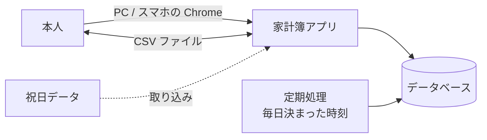
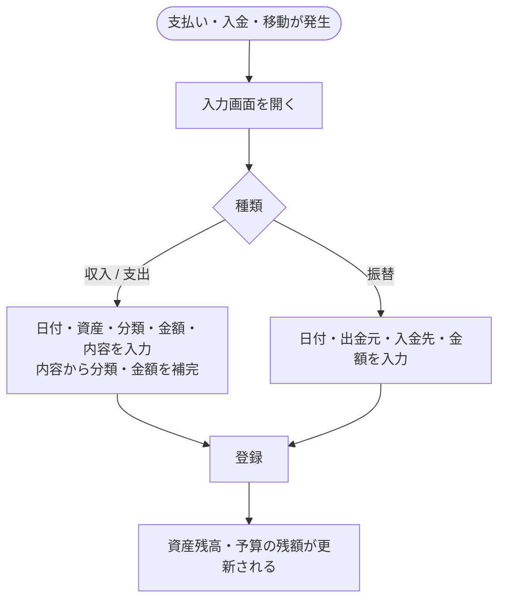
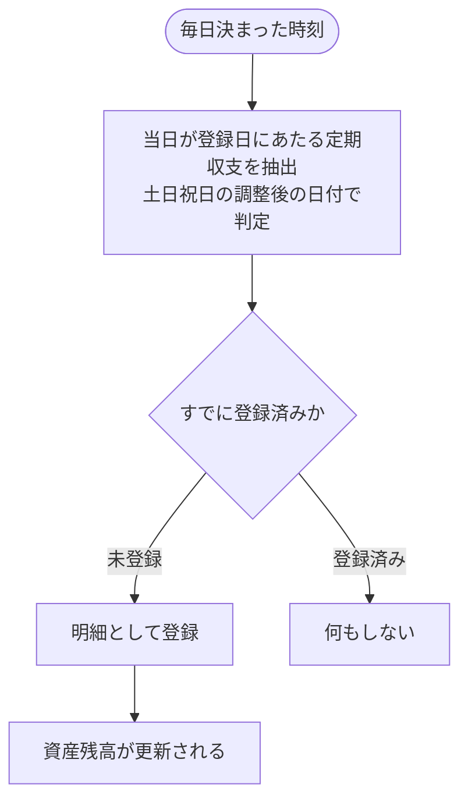

# 要件定義書：家計簿アプリ（BudgetManager）

| 項目 | 内容 |
|---|---|
| 文書番号 | 01 |
| 版数 | 0.1（レビュー待ち） |
| 作成日 | 2026-09-30 |
| 作成者 | major182 |

---

## 目次

1. [はじめに](#1-はじめに)
2. [システム化の概要](#2-システム化の概要)
3. [業務要件](#3-業務要件)
4. [機能要件](#4-機能要件)
5. [データ要件](#5-データ要件)
6. [外部インターフェース要件](#6-外部インターフェース要件)
7. [非機能要件](#7-非機能要件)
8. [制約条件・前提条件](#8-制約条件前提条件)
9. [受け入れ基準](#9-受け入れ基準)
10. [未決事項](#10-未決事項)
11. [用語集](#11-用語集)
12. [改訂履歴](#12-改訂履歴)

### この文書の読み方

- 要件にはすべて **ID** を振る。設計書・テスト仕様書・Issue からは、この ID で参照する

  | 接頭辞 | 種類 | 例 |
  |---|---|---|
  | `BR` | 業務ルール（Business Rule） | BR-01 |
  | `F` | 機能要件（Function） | F-TX-01 |
  | `SC` | 画面（Screen） | SC-01 |
  | `BT` | バッチ処理（Batch） | BT-01 |
  | `IF` | 外部インターフェース（Interface） | IF-01 |
  | `NF` | 非機能要件（Non-Functional） | NF-SE-01 |
  | `Q` | 未決事項（Question） | Q-01 |

- 本書に載っている機能はすべて**必須（MUST）**。優先度による取捨選択は行わない

---

## 1. はじめに

### 1.1 背景

日々の支出を記録していても、「今月あといくら使えるか」「どの分類にお金を使いすぎているか」「口座やカードに今いくらあるか」が一目で分からないと、家計の見直しにつながらない。
紙やスプレッドシートでの管理は、集計やグラフ化に手間がかかり、長続きしにくい。

### 1.2 目的

1. 収入・支出・資産間の移動を、**PC とスマホのどちらからでも手早く記録できる**ようにする
2. 記録した内容から、**分類別・期間別の集計とグラフを自動で作る**
3. 予算に対する使いすぎに**早めに気づけるようにする**
4. 口座・現金・クレジットカードごとの**残高を常に把握できるようにする**

### 1.3 スコープ

| 区分 | 内容 |
|---|---|
| 対象 | 収支・振替の記録、一覧・カレンダー表示、統計・グラフ、予算管理、資産管理、分類管理、定期収支の自動登録、CSV での出力・取り込み、表示設定 |
| 対象外 | 利用者登録・ログイン（→ BR-01）、複数人での共有、外貨、銀行・カード会社との自動連携、レシートの読み取り、音声入力、ネイティブアプリ（スマホアプリ）、データの手動バックアップ・復元機能（→ NF-AV-03） |

### 1.4 利用者

| 利用者 | 人数 | 利用環境 | 主な利用場面 |
|---|---|---|---|
| 本人（家計の管理者） | 1人 | PC の Chrome、スマホの Chrome | 外出先ではスマホで支出をその場で入力する。自宅では PC で月の振り返り・予算の設定・分類の整理を行う |

---

## 2. システム化の概要

### 2.1 システム全体像

- アプリはインターネット上（AWS）で動かし、**本人の端末からしか接続できないようにする**（→ BR-01、NF-SE-01）
- 定期収支の自動登録は、利用者がアプリを開いていなくてもサーバー側で毎日実行する（→ BT-01）

### 2.2 システム化による変化

| 業務 | 現状（手作業） | システム化後 |
|---|---|---|
| 記録 | メモやスプレッドシートに書く | スマホから数タップで登録。過去の入力から内容を補完する |
| 定期的な支払い | 毎回手で書く | 周期を登録しておけば自動で登録される |
| 集計 | 月末に手で合計する | 期間・分類を選ぶだけで集計とグラフが出る |
| 予算の確認 | 月末まで分からない | 入力のたびに残額が分かる |
| 残高の確認 | 通帳・アプリを個別に見る | 資産ごとの残高を一覧で確認できる |

---

## 3. 業務要件

### 3.1 業務一覧

| No | 業務 | 頻度 | 実施者 | 概要 |
|---|---|---|---|---|
| G-01 | 日々の記録 | 毎日 | 本人 | 買い物・収入・口座間の移動を記録する |
| G-02 | 定期収支の登録 | 毎日 | システム | 登録済みの定期収支を、その日になったら明細として登録する |
| G-03 | 月次の振り返り | 月1回 | 本人 | 月の収支・分類別の支出・予算の消化状況を確認する |
| G-04 | 予算の設定 | 月1回〜随時 | 本人 | 全体・分類別の予算を決める |
| G-05 | 資産の確認 | 随時 | 本人 | 口座・現金・カードの残高、カードの未払い額を確認する |
| G-06 | マスタの整備 | 随時 | 本人 | 分類・資産・定期収支を登録・変更する |
| G-07 | データの出し入れ | 随時 | 本人 | 明細を CSV で出力する。既存のデータを CSV で取り込む |

### 3.2 業務フロー

#### G-01 日々の記録

#### G-02 定期収支の登録（システム）

#### G-03 月次の振り返り

1. 家計簿画面の月別表示で、月の収入・支出・差額を確認する
2. 統計画面で、支出の分類別の割合（円グラフ）を確認する
3. 予算の消化状況を確認し、使いすぎた分類を把握する
4. 必要に応じて翌月の予算を見直す（G-04）

### 3.3 業務ルール

#### 共通

| ID | ルール |
|---|---|
| BR-01 | 利用者は本人1人のみ。アプリには利用者登録・ログインを設けず、**本人の端末以外からは接続できない仕組み**で保護する（具体的な方法は Q-01） |
| BR-02 | 金額は**円の整数**で扱う。小数は扱わない |
| BR-03 | 1件の明細の金額の範囲は **−99,999,999 〜 99,999,999 円**。0円は登録できない。マイナスは支出にのみ使える（BR-12） |
| BR-04 | 日付は日本時間（JST）で扱う |

#### 明細（収入・支出・振替）

| ID | ルール |
|---|---|
| BR-10 | 明細の種類は「収入」「支出」「振替」の3つ |
| BR-11 | 収入・支出は、必ず1つの資産と1つの分類に結びつける。資産の残高は、収入で増え、支出で減る |
| BR-12 | 支出にマイナスの金額を入れた場合は、返品・払い戻しとして扱う。その分類の支出合計から差し引き、資産の残高は増える |
| BR-13 | 振替は、出金元の資産から入金先の資産へお金を移す。出金元と入金先は別の資産でなければならない |
| BR-14 | 振替は**収入・支出の集計に含めない**。資産の残高にのみ反映する |
| BR-15 | 明細をコピーした場合、日付は当日にし、それ以外の項目は元の明細を引き継ぐ |

#### 期間（月・週）

| ID | ルール |
|---|---|
| BR-20 | 月の開始日は 1〜28 日、または「月末」から選ぶ。初期値は1日。例：開始日が25日なら「10月」は 9/25〜10/24 |
| BR-21 | 月の開始日が土日祝日にあたる場合の扱いを「そのまま／前の平日／次の平日」から選べる。初期値は「そのまま」 |
| BR-22 | 週の開始曜日は日曜・月曜から選ぶ。初期値は日曜。カレンダー表示の曜日の並びに使う |

#### 分類

| ID | ルール |
|---|---|
| BR-30 | 分類は収入用・支出用に分かれる。収入の明細に支出用の分類は使えない（逆も同じ） |
| BR-31 | 分類は**大分類・小分類の2階層**。小分類の下にさらに分類は作れない。小分類は省略できる |
| BR-32 | 大分類を小分類へ移動できるのは、その大分類が小分類を持っていない場合のみ（3階層になるのを防ぐため） |
| BR-33 | 明細で使われている分類は削除できない。使わなくなった分類は「非表示」にでき、入力時の選択肢に出なくなる（過去の明細・集計には残る） |
| BR-34 | 利用開始時に、よく使う分類を初期データとして用意する（内容は 5.3） |

#### 資産

| ID | ルール |
|---|---|
| BR-40 | 資産は必ず1つの資産グループ（現金・銀行口座・クレジットカード・電子マネーなど）に属する |
| BR-41 | 資産には開始残高を設定できる。現在残高 ＝ 開始残高 ＋ 収入 − 支出 ＋ 振替での入金 − 振替での出金 |
| BR-42 | クレジットカードの資産は**負債**として扱い、残高はマイナス（未払い額）で表す。純資産 ＝ 資産の合計 − 負債の合計 |
| BR-43 | クレジットカードには締め日・引き落とし日・引き落とし口座を設定する。締め日までの利用分が、次の引き落とし日の請求額になる |
| BR-44 | 明細で使われている資産は削除できない。使わなくなった資産は「非表示」にできる |

#### 予算

| ID | ルール |
|---|---|
| BR-50 | 予算は月単位。「全体予算」と「支出の大分類ごとの予算」を設定できる |
| BR-51 | 予算には基本額を設定し、特定の月だけ別の額に変えられる。月別の額がない月は基本額を使う |
| BR-52 | 予算の消化額は、その月（BR-20 の期間）の支出の合計。マイナス支出は差し引き、振替は含めない |
| BR-53 | 繰越を有効にした予算は、前月の残額（予算 − 消化額）を当月の予算に加える。前月が超過していた場合（残額がマイナス）の扱いは Q-03 |

#### 定期収支

| ID | ルール |
|---|---|
| BR-60 | 定期収支は、種類（収入・支出・振替）・資産・分類・金額・内容・周期・開始日・終了日（任意）を持つ |
| BR-61 | 周期は「毎月◯日」「毎月末」「毎週◯曜日」「毎年◯月◯日」から選ぶ。指定日がその月にない場合（例：31日）はその月の末日とする |
| BR-62 | 登録日が土日祝日にあたる場合の扱いを、定期収支ごとに「**そのまま／前営業日／後営業日**」から選ぶ。営業日とは土日祝日と年末年始（12/31〜1/3）以外の日を指す |
| BR-63 | 定期収支は、調整後の登録日の当日に、**利用者がアプリを開いていなくても**自動で明細として登録する |
| BR-64 | 同じ定期収支の同じ回を、二重に登録してはならない。処理が止まっていた日があった場合は、次回の実行時に未登録分をさかのぼって登録する |
| BR-65 | 自動登録された明細は、通常の明細と同じように編集・削除できる。編集しても定期収支の設定には影響しない |

---

## 4. 機能要件

### 4.1 機能一覧

#### 収支の入力（TX）

| ID | 機能 | 概要 | 関連ルール |
|---|---|---|---|
| F-TX-01 | 収入・支出の登録 | 日付・資産・分類（大・小）・金額・内容・メモを入力して登録する | BR-02〜04, 10〜12 |
| F-TX-02 | 振替の登録 | 日付・出金元・入金先・金額・内容・メモを入力して登録する | BR-13, 14 |
| F-TX-03 | 明細の編集・削除 | 登録済みの明細を変更・削除する。削除前に確認する | |
| F-TX-04 | 明細のコピー | 登録済みの明細を元に、新しい明細を作る | BR-15 |
| F-TX-05 | 入力の補完 | 内容を入力すると、過去に同じ内容で登録した明細の分類・資産・金額を候補として示し、選ぶと入力欄に反映する | |
| F-TX-06 | 電卓 | 金額欄から画面上の電卓を開き、四則演算の結果を金額に入れる | |
| F-TX-07 | マイナス支出の登録 | 支出にマイナスの金額を入力できる | BR-12 |

#### 一覧・表示（LS）

| ID | 機能 | 概要 | 関連ルール |
|---|---|---|---|
| F-LS-01 | 日別一覧 | 期間内の明細を日ごとにまとめ、日ごとの収入・支出の合計とともに表示する | BR-14 |
| F-LS-02 | カレンダー表示 | 月のカレンダーの各日に、収入・支出の合計を表示する。日付を選ぶとその日の明細を表示する | BR-22 |
| F-LS-03 | 月別一覧 | 年内の各月の収入・支出・差額を表示する | BR-20 |
| F-LS-04 | 期間の合計表示 | 表示中の期間の収入・支出・差額を画面上部に表示する | BR-14 |
| F-LS-05 | 期間の切り替え | 前後の月・年に移動する。当月に戻れる | BR-20 |
| F-LS-06 | 明細の検索 | 内容・メモ（部分一致）、種類、分類、資産、金額の範囲、期間で絞り込む | |

#### 統計・グラフ（ST）

| ID | 機能 | 概要 | 関連ルール |
|---|---|---|---|
| F-ST-01 | 分類別の集計 | 期間内の収入・支出を大分類ごとに集計し、円グラフと金額・割合の一覧で表示する | BR-12, 14 |
| F-ST-02 | 小分類への掘り下げ | 大分類を選ぶと、その中の小分類ごとの集計を表示する | BR-31 |
| F-ST-03 | 期間の単位の切り替え | 集計の単位を月・年から選ぶ | BR-20 |
| F-ST-04 | 分類別の推移グラフ | 選んだ分類の月ごとの金額を、棒グラフで過去12か月分表示する | |
| F-ST-05 | 資産の推移グラフ | 資産全体・負債・純資産、または個別の資産の月末残高を、折れ線グラフで過去12か月分表示する | BR-41, 42 |

#### 予算（BG）

| ID | 機能 | 概要 | 関連ルール |
|---|---|---|---|
| F-BG-01 | 予算の設定 | 全体予算と大分類ごとの予算の基本額を設定する | BR-50, 51 |
| F-BG-02 | 月別予算の設定 | 特定の月の予算額を基本額から変更する | BR-51 |
| F-BG-03 | 繰越の設定 | 予算ごとに繰越の有効・無効を切り替える | BR-53 |
| F-BG-04 | 予算の消化状況 | 予算ごとに予算額・消化額・残額・消化率を表示する。超過した予算は目立つ色で示す | BR-52, 53 |

#### 資産（AS）

| ID | 機能 | 概要 | 関連ルール |
|---|---|---|---|
| F-AS-01 | 資産の管理 | 資産の追加・編集・非表示・削除・並べ替えを行う | BR-40, 41, 44 |
| F-AS-02 | 資産グループの管理 | 資産グループの追加・編集・削除・並べ替えを行う | BR-40 |
| F-AS-03 | 資産一覧 | 資産グループごとに資産の現在残高を表示し、資産合計・負債合計・純資産を表示する | BR-41, 42 |
| F-AS-04 | 資産ごとの明細 | 資産を選ぶと、その資産に関わる明細と残高の推移を表示する | |
| F-AS-05 | クレジットカードの管理 | 締め日・引き落とし日・引き落とし口座を設定し、次回の請求額と引き落とし予定日を表示する | BR-42, 43 |

#### 分類（CT）

| ID | 機能 | 概要 | 関連ルール |
|---|---|---|---|
| F-CT-01 | 分類の管理 | 収入・支出それぞれの大分類・小分類の追加・編集・非表示・削除・並べ替えを行う | BR-30, 31, 33 |
| F-CT-02 | 分類の移動 | 大分類を別の大分類の小分類に、小分類を大分類に移す | BR-32 |
| F-CT-03 | 初期分類の用意 | 初回利用時に初期分類を登録する | BR-34 |

#### 定期収支（RC）

| ID | 機能 | 概要 | 関連ルール |
|---|---|---|---|
| F-RC-01 | 定期収支の管理 | 定期収支の追加・編集・削除を行う | BR-60〜62 |
| F-RC-02 | 定期収支の一覧 | 登録済みの定期収支と、次回の登録予定日（土日祝日の調整後）を表示する | BR-62 |

#### データの出し入れ（IO）

| ID | 機能 | 概要 | 関連ルール |
|---|---|---|---|
| F-IO-01 | CSV 出力 | 月単位・年単位で明細を CSV ファイルに出力する | IF-02 |
| F-IO-02 | CSV 取り込み | CSV ファイルの明細を取り込む。1件でも誤りがあれば**全件取り込まず**、誤りのある行と理由を表示する | IF-02 |

#### 設定（CF）

| ID | 機能 | 概要 | 関連ルール |
|---|---|---|---|
| F-CF-01 | 通貨の表示形式 | 通貨記号（¥ / 円 / なし）と、桁区切りの有無を設定する | BR-02 |
| F-CF-02 | 月の開始日 | 月の開始日と、休日にあたる場合の扱いを設定する | BR-20, 21 |
| F-CF-03 | 週の開始曜日 | 日曜・月曜から選ぶ | BR-22 |
| F-CF-04 | 画面のテーマ | ライト・ダーク・端末の設定に合わせる、から選ぶ | |

### 4.2 画面一覧

メニューで主要4画面を切り替える。**スマホでは画面下部、PC では画面左側**にメニューを置く。

| ID | 画面 | 種別 | 主な機能 |
|---|---|---|---|
| SC-01 | 家計簿 | メイン | F-LS-01〜05（タブで日別・カレンダー・月別を切り替え） |
| SC-02 | 明細入力 | 入力 | F-TX-01〜07（新規・編集・コピー共通） |
| SC-03 | 検索 | 照会 | F-LS-06 |
| SC-04 | 統計 | メイン | F-ST-01〜03、F-BG-04 |
| SC-05 | 推移グラフ | 照会 | F-ST-04、F-ST-05 |
| SC-06 | 資産 | メイン | F-AS-03 |
| SC-07 | 資産詳細 | 照会 | F-AS-04、F-AS-05（表示） |
| SC-08 | 設定 | メイン | 各設定画面への入口 |
| SC-09 | 分類管理 | 設定 | F-CT-01、F-CT-02 |
| SC-10 | 資産管理 | 設定 | F-AS-01、F-AS-02、F-AS-05（設定） |
| SC-11 | 予算設定 | 設定 | F-BG-01〜03 |
| SC-12 | 定期収支管理 | 設定 | F-RC-01、F-RC-02 |
| SC-13 | CSV 出力・取り込み | 設定 | F-IO-01、F-IO-02 |
| SC-14 | 表示設定 | 設定 | F-CF-01〜04 |

画面項目・レイアウト・遷移の詳細は画面設計書で定める。

### 4.3 バッチ処理一覧

| ID | 処理 | 実行タイミング | 概要 | 関連ルール |
|---|---|---|---|---|
| BT-01 | 定期収支の自動登録 | 毎日 0:05（JST） | 当日が登録日（土日祝日の調整後）にあたる定期収支を明細として登録する。未実行の日があれば、さかのぼって登録する | BR-61〜65 |
| BT-02 | 祝日データの更新 | 年1回以上（手動でも可） | 祝日データを取り込み、翌年分までの祝日を最新にする | IF-01 |

### 4.4 帳票

なし（印刷用の出力は作らない。データの持ち出しは CSV 出力で行う）。

---

## 5. データ要件

### 5.1 主なデータ（エンティティ）

| データ | 主な項目 | 件数の目安 |
|---|---|---|
| 明細 | 種類、日付、金額、資産、振替先の資産、分類、内容、メモ、登録元（手入力／定期収支／CSV） | 年 3,000〜4,000 件 |
| 資産グループ | 名前、並び順 | 〜10 |
| 資産 | 名前、資産グループ、開始残高、負債かどうか、非表示、並び順、（カードのみ）締め日・引き落とし日・引き落とし口座 | 〜30 |
| 分類 | 名前、収入用／支出用、親の分類、非表示、並び順 | 〜100 |
| 予算 | 対象（全体または大分類）、基本額、繰越の有無 | 〜30 |
| 月別予算 | 予算、年月、金額 | 〜400 |
| 定期収支 | 種類、資産、分類、金額、内容、周期、休日の扱い、開始日、終了日 | 〜50 |
| 定期収支の登録履歴 | 定期収支、対象日、登録した明細 | 年 〜600 |
| 祝日 | 日付、名前 | 年 〜20 |
| 設定 | 通貨記号、桁区切り、月の開始日、休日の扱い、週の開始曜日、テーマ | 1 |

### 5.2 データの保存期間

- 明細・マスタは、本人が削除しない限り**無期限に保存**する
- 10年分（約 40,000 件）の明細を保存しても、性能要件（NF-PF）を満たすこと

### 5.3 初期データ

| 種類 | 内容 |
|---|---|
| 支出の分類 | 食費、日用品、交通費、交際費、趣味・娯楽、衣服・美容、健康・医療、教育・教養、住居、水道・光熱費、通信費、保険、税金、その他 |
| 収入の分類 | 給与、賞与、副業、臨時収入、その他 |
| 資産グループ | 現金、銀行口座、クレジットカード、電子マネー |
| 資産 | 財布（現金） |

小分類の初期データの有無は Q-04。

---

## 6. 外部インターフェース要件

| ID | 相手 | 方向 | 形式 | 内容 |
|---|---|---|---|---|
| IF-01 | 祝日データ（内閣府「国民の祝日について」の CSV） | 取り込み | CSV | 日付・祝日名。振替休日・国民の休日を含む |
| IF-02 | 利用者（CSV ファイル） | 出力・取り込み | CSV（UTF-8・BOM 付き・カンマ区切り） | 明細の出し入れ。Excel でそのまま開けるよう BOM を付ける。列の定義は設計書で定める |

---

## 7. 非機能要件

IPA「非機能要求グレード」の6つの大項目に沿って定める。個人利用のため、業務システムより低い水準を許容する。

### 7.1 可用性（AV）

| ID | 要件 |
|---|---|
| NF-AV-01 | 利用時間は24時間365日を目標とする。ただし、更新作業などによる停止は予告なく行ってよい |
| NF-AV-02 | 障害時は、本人が気づいた時点で復旧すればよい（常時の監視・即時復旧は求めない） |
| NF-AV-03 | データベースを**毎日自動でバックアップ**し、7日間保存する。障害時は最大1日前の状態に戻せること |

### 7.2 性能・拡張性（PF）

| ID | 要件 |
|---|---|
| NF-PF-01 | 画面の表示・登録は、通常の通信環境で **2秒以内** |
| NF-PF-02 | 統計・グラフの表示は、年単位の集計で **3秒以内** |
| NF-PF-03 | 明細 40,000 件（10年分）の状態で NF-PF-01・02 を満たす |
| NF-PF-04 | CSV の取り込みは、1回あたり 5,000 件まで |

### 7.3 運用・保守性（OP）

| ID | 要件 |
|---|---|
| NF-OP-01 | アプリのエラーはログに記録し、原因を追えるようにする。ログは30日間保存する |
| NF-OP-02 | 定期処理（BT-01）の実行結果（登録件数・失敗）をログに記録する |
| NF-OP-03 | インフラの構成はコード（Terraform）で管理し、手順書に沿って作り直せること |
| NF-OP-04 | 変更は GitHub の Pull Request を通して行い、自動テスト（CI）が通ったものだけを反映する |

### 7.4 移行性（MG）

| ID | 要件 |
|---|---|
| NF-MG-01 | 既存システムからの移行はない。過去の家計簿データは F-IO-02（CSV 取り込み）で取り込む |

### 7.5 セキュリティ（SE）

| ID | 要件 |
|---|---|
| NF-SE-01 | **本人の端末以外からアプリに接続できないようにする**（方法は Q-01）。第三者が URL を知っても、画面・データに触れられないこと |
| NF-SE-02 | 通信はすべて HTTPS で暗号化する |
| NF-SE-03 | データベースはインターネットから直接接続できない場所に置く |
| NF-SE-04 | パスワード・接続情報などの秘密情報を、ソースコード・リポジトリに含めない |
| NF-SE-05 | 入力値はサーバー側でも検証し、SQL インジェクション・クロスサイトスクリプティングを防ぐ |

### 7.6 システム環境・エコロジー（EN）

| ID | 要件 |
|---|---|
| NF-EN-01 | 対応ブラウザは **Google Chrome の最新版のみ**（PC：Windows・Mac、スマホ：Android・iOS） |
| NF-EN-02 | 対応する画面幅は **360px（スマホ）〜 1920px（PC）**。768px 未満をスマホ向けのレイアウトとする |
| NF-EN-03 | サーバーは AWS の東京リージョンで動かす |
| NF-EN-04 | 月々のクラウド利用料を抑えるため、必要最小限の構成にする（目安は Q-05） |

### 7.7 使いやすさ（UX）

| ID | 要件 |
|---|---|
| NF-UX-01 | スマホで、入力画面を開いてから支出を登録するまでを **10秒程度**で行えること |
| NF-UX-02 | スマホではボタンなどの操作対象を指で押しやすい大きさ（44px 四方以上）にする |
| NF-UX-03 | 入力の誤りは、どの項目がなぜ誤りかを日本語で示す |

---

## 8. 制約条件・前提条件

### 8.1 制約条件

| No | 内容 |
|---|---|
| C-01 | スクール課題の指定により、前回の課題で使った技術は使わない。バックエンドは Java / Spring Boot 以外、フロントエンドは React 以外、データベースは PostgreSQL 以外、ビルドツールは Gradle・Vite 以外から選ぶ |
| C-02 | インフラ・ツール類（AWS、Terraform、Docker、GitHub）は前回と同じものを使ってよい |
| C-03 | 開発者は1人（利用者本人）で、学習を兼ねて開発する |

### 8.2 前提条件

| No | 内容 |
|---|---|
| P-01 | 利用者は本人1人で、同時に複数の端末から編集することはほとんどない |
| P-02 | 利用者の端末は、常に最新版の Chrome を使っている |
| P-03 | 祝日データは、公開されている内閣府の CSV から取得できる |

---

## 9. 受け入れ基準

次のすべてを満たしたとき、本システムの完成とする。

1. 4章のすべての機能が、テスト仕様書のテストに合格している
2. 7章の非機能要件のうち、NF-PF・NF-SE・NF-EN の要件を実機（PC とスマホの Chrome）で確認している
3. BT-01 が、土日祝日の3つの扱い・月末・さかのぼり登録のそれぞれで正しく動くことを確認している
4. 本人の端末以外から接続できないことを確認している（NF-SE-01）
5. AWS 上で動き、デプロイ手順書に沿って環境を作り直せる

---

## 10. 未決事項

| ID | 内容 | 決める時期 |
|---|---|---|
| Q-01 | 本人の端末以外から接続させない具体的な方法（接続元 IP の制限、VPN、アプリの手前での認証 など）。スマホの回線は IP が変わる点を考慮する | 技術選定・デプロイ設計 |
| Q-02 | クレジットカードの引き落とし日に、引き落とし口座からカードへの振替を自動で登録するか（現状は請求額と予定日の表示のみ） | 基本設計 |
| Q-03 | 繰越で、前月が予算超過（残額がマイナス）だった場合に、当月の予算から差し引くか | 基本設計 |
| Q-04 | 支出の分類に小分類の初期データを用意するか | 基本設計 |
| Q-05 | 月々のクラウド利用料の上限の目安 | 技術選定 |

---

## 11. 用語集

| 用語 | 意味 |
|---|---|
| 明細 | 1件の収入・支出・振替の記録 |
| 収入 | 給与など、資産が外から増えるお金の動き |
| 支出 | 買い物など、資産が外へ減るお金の動き |
| 振替 | 自分の資産どうしの間でのお金の移動（例：ATM で口座から現金を引き出す、カードの引き落とし）。収入・支出には数えない |
| マイナス支出 | 返品・払い戻しなど、支出を取り消す方向のお金の動き |
| 資産 | お金の置き場所。現金・銀行口座・クレジットカード・電子マネーなど |
| 資産グループ | 資産を種類ごとにまとめたもの |
| 負債 | 後で支払う必要のあるお金。本システムではクレジットカードの未払い額 |
| 純資産 | 資産の合計から負債の合計を引いた額 |
| 大分類・小分類 | 明細の用途の区分。例：大分類「食費」、小分類「外食」 |
| 予算 | 1か月に使ってよい支出の上限額 |
| 消化額・消化率 | 予算に対して実際に使った額と、その割合 |
| 繰越 | 前月に使い切らなかった予算を当月の予算に上乗せすること |
| 定期収支 | 給与・家賃・サブスクなど、決まった周期で発生する収支・振替の登録ルール |
| 営業日 | 土日・祝日・年末年始（12/31〜1/3）以外の日 |
| 前営業日・後営業日 | ある日の直前・直後の営業日 |
| 締め日・引き落とし日 | クレジットカードの利用額を区切る日と、その請求額が口座から引き落とされる日 |
| バッチ処理 | 利用者の操作とは関係なく、決まった時刻にサーバーが自動で行う処理 |
| CSV | 値をカンマで区切って並べたテキストファイル。Excel で開ける |

---

## 12. 改訂履歴

| 版数 | 日付 | 内容 |
|---|---|---|
| 0.1 | 2026-09-30 | 初版作成 |
