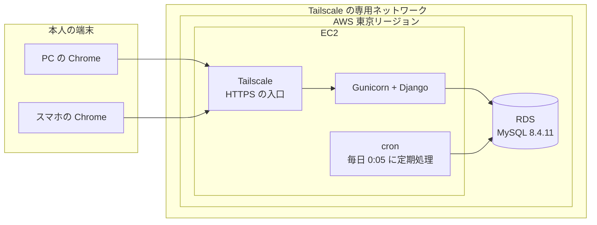

# 技術選定書：家計簿アプリ（BudgetManager）

| 項目 | 内容 |
|---|---|
| 文書番号 | 02 |
| 版数 | 0.4 |
| 作成日 | 2026-09-30 |
| 作成者 | major182 |
| 前提となる文書 | [01 要件定義書](01_requirements.md) |

---

## 1. この文書の目的

家計簿アプリで使う技術を決め、**なぜそれを選んだか・なぜ他を選ばなかったか**を残す。
後から「別の技術のほうがよかったのでは」と迷ったときに、判断の根拠に立ち返れるようにする。

---

## 2. 選定の条件

要件定義書から、技術選定に効く条件を抜き出す。

| No | 条件 | 出典 |
|---|---|---|
| 1 | Java / Spring Boot・React・PostgreSQL・Gradle・Vite は使えない（Vite を内部で使うフレームワークも含む） | C-01 |
| 2 | 費用をかけない。AWS は無料配布クレジットの範囲内、ツール・ライブラリも無料のもの | C-04、NF-EN-04 |
| 3 | 金額・消費税を**誤差なく**計算できる（小数を含む税率の計算と、3種類の端数処理） | BR-02、BR-73、BR-74 |
| 4 | 毎日決まった時刻に、利用者の操作と関係なく処理を動かせる | BT-01、BR-63 |
| 5 | PC とスマホの両方で使える画面、グラフの表示 | NF-EN-02、F-ST |
| 6 | 本人の端末以外からは接続できない（ログインは作らない） | BR-01、NF-SE-01 |
| 7 | 開発者1人が学習しながら作れる。覚える技術の数を絞る | C-03 |
| 8 | 利用者の希望として **Python を使いたい** | 利用者の希望 |

---

## 3. 採用技術の一覧

バージョンは 2026-09-30 時点で確認したもの。**LTS（長期サポート版）がある技術は最新の LTS を、LTS がない技術は最新の安定版を使う。**

フロントエンドとバックエンドは、**1つの Django プロジェクトの中に同居する**（前回のように別々のアプリには分けない）。
フロントエンドはブラウザで表示・実行される部分（テンプレート・CSS・JavaScript）、バックエンドはサーバーで動く部分を指す。

### 3.1 フロントエンド（ブラウザで表示・実行される部分）

| 区分 | 採用する技術 | バージョン | サポート期限 |
|---|---|---|---|
| 画面の記述 | Django テンプレート（HTML） | Django に同梱 | ― |
| 画面の部分更新 | **htmx** | 2.0.11 | ― |
| グラフ | **Chart.js** | 4.5.1 | ― |
| 画面の動き（電卓・税額の表示など） | 素の JavaScript | ― | ― |
| 画面のスタイル | 素の CSS（CSS 変数でテーマを切り替え） | ― | ― |
| ビルド | **なし**（ブラウザがそのまま読めるファイルだけで作る） | ― | ― |

### 3.2 バックエンド（サーバーで動く部分）

| 区分 | 採用する技術 | バージョン | サポート期限 |
|---|---|---|---|
| 言語 | **Python** | 3.14.7（※1） | 2030-10 |
| Web フレームワーク | **Django** | 5.2.17 (LTS) | 2028-04 |
| DB ドライバー | mysqlclient | 2.3.0 | ― |
| 環境変数の読み込み | django-environ | 0.14.0 | ― |
| アプリケーションサーバー | Gunicorn | 26.2.0 | ― |
| CSS・JS の配信 | WhiteNoise | 6.12.0 | ― |
| 定期処理 | Django の管理コマンド + cron | ― | ― |
| パッケージ管理・ビルド | **uv** | 0.12.21 | ― |

### 3.3 データベース

| 区分 | 採用する技術 | バージョン | サポート期限 |
|---|---|---|---|
| データベース | **MySQL**（本番は RDS for MySQL、開発・テストは Docker） | 8.4.11 (LTS)（※2） | 2029-07 |

### 3.4 開発ツール（静的解析・テスト）

| 区分 | 採用する技術 | バージョン | サポート期限 |
|---|---|---|---|
| lint・整形 | **Ruff** | 0.16.9 | ― |
| 型チェック | **mypy** + django-stubs + django-stubs-ext | 1.19.1 + 5.2.9 + 5.2.9（※3） | ― |
| テスト | **pytest** + pytest-django | 9.1.1 + 4.14.0 | ― |
| CI | GitHub Actions | ― | ― |

### 3.5 インフラ

| 区分 | 採用する技術 | バージョン | サポート期限 |
|---|---|---|---|
| サーバーの OS | Amazon Linux 2023 | 2023.12（※4） | 2029-06 |
| 接続の制限 | **Tailscale**（VPN） | 1.102.5 | ― |
| インフラの構成管理 | Terraform + AWS プロバイダー | 1.16.5 + 6.67.0 | ― |
| コンテナ | Docker Engine | 29.8.0（開発の PC）（※5） | ― |

### 3.6 注記

- ※1 Python には LTS の制度がなく、各バージョンが公開から5年間サポートされる。**最新の 3.14 がサポート期限も最も長い**。Django 5.2 は 5.2.8 以降で Python 3.14 に正式対応している
- ※2 MySQL の最新の LTS は 9.7 だが、2026-09 時点で **AWS の RDS では 9.x が提供されていない**（東京リージョンで確認）。RDS で使える最新の LTS である 8.4 を使う。RDS が 9.7 に対応したら移行を検討する
- ※3 mypy の最新は 2.3.1 だが、Django 5.2 用の型定義（django-stubs 5.2.9）が対応している mypy は 1.19 まで。**Django 5.2 と組み合わせられる最新**の 1.19.1 を使う
- ※4 Amazon Linux 2023 はバージョンを固定せず、毎回の起動時に最新の更新版を使う
- ※5 サーバー（EC2）では、Amazon Linux 2023 の公式のパッケージの Docker を使う（Docker 社は Amazon Linux 2023 向けのパッケージを出していない）。2026-10-06 の構築では 25.0.16（06 デプロイ設計書 4.1）
- htmx には 4.0.0 が「next」（正式版の前の試験版）として公開されているが、正式版ではないため 2.0.11 を使う
- パッチ番号（末尾の数字）の更新は、不具合・脆弱性の修正のみのため、随時取り込む

---

## 4. 全体の構成

- 画面の HTML は **サーバー（Django）が組み立てて**ブラウザに返す。htmx は、ページ全体を読み直さずに**一部分だけを差し替える**ために使う
- サーバーは**インターネットに公開しない**。本人の端末から Tailscale を通したときだけ接続できる（6章）

---

## 5. 区分ごとの選定理由

### 5.1 言語：Python

**選んだ理由**

- 利用者が使ってみたい言語である（条件 8）
- 標準の `Decimal` 型で金額と税率を**誤差なく計算でき**、切り捨て・四捨五入・切り上げを指定できる（条件 3）
- 日付・CSV を扱う標準ライブラリが充実しており、祝日の判定・営業日へのずらし・CSV の出し入れを追加のライブラリなしで書ける
- 学習用の資料が多く、エラーが出ても調べやすい

**比較した候補**

| 候補 | 選ばなかった理由 |
|---|---|
| TypeScript（Node.js） | 金額の計算で標準の数値型に誤差が出るため、別のライブラリが必要。利用者の希望と異なる |
| Go | 画面を作る仕組みが薄く、自分で組み立てる部分が多い。学習の負担が大きい |
| PHP（Laravel） | 選択肢として成り立つが、利用者の希望と異なる |

### 5.2 Web フレームワーク：Django

**選んだ理由**

- 画面（テンプレート）・データベース操作（ORM）・入力チェック（フォーム）・DB の構造の変更管理（マイグレーション）が**最初から揃っている**。組み合わせを自分で選ぶ必要がない（条件 7）
- 分類・税率・資産・予算・定期収支と、**管理する対象（マスタ）が多い**このアプリに向いている
- 自作のコマンド（管理コマンド）を簡単に作れるため、定期収支の自動登録（BT-01）と祝日データの更新（BT-02）をそのまま実装できる（条件 4）
- **XSS・CSRF・SQL インジェクション・クリックジャッキングへの対策が標準で有効**になっている（7章）

**バージョン：5.2.17（最新の LTS）を選ぶ理由**

2026-09 時点の最新は 6.1.1 だが、6.1 は LTS ではなく、サポート期限は 6.1 が 2027-12、5.2 が 2028-04 で、**5.2 のほうが長い**。
次の LTS（6.2）は 2027-04 に公開される予定のため、公開後に移行を検討する。

**比較した候補**

| 候補 | 選ばなかった理由 |
|---|---|
| FastAPI | API（データの受け渡し）だけを作るフレームワーク。画面を別のフレームワークで作る必要があり、作るもの・覚えるものが2倍になる。DB 操作・入力フォーム・マイグレーションも別のライブラリを組み合わせる必要がある |
| Flask | 最小限の機能しか持たず、DB 操作・フォーム・マイグレーションを自分で選んで組み合わせる必要がある。組み合わせの判断が学習者には難しい |

### 5.3 画面：Django テンプレート + htmx（ビルドツールを使わない構成）

**選んだ理由**

- 画面は Django が HTML を組み立てて返すため、**TypeScript や JSX を変換する工程（ビルド）がそもそも不要**。フロントエンドのビルドツールの制約（条件 1）を、ツールを使わないことで満たす
- htmx は、HTML に `hx-get` などの属性を書くだけで、**ページ全体を読み直さずに一部分を差し替えられる**。月の切り替えや明細の登録で画面がちらつかない
- 書く言語が **Python と HTML にほぼ絞られる**（条件 7）
- 画面の状態をサーバー側で持つため、前回のような「サーバーのデータを画面側でどう管理するか」を考える必要がない

**JavaScript を書く部分**

電卓（F-TX-06）など、サーバーに問い合わせるまでもない画面上の動きは、**ブラウザがそのまま読めるふつうの JavaScript** で書く。これもビルドは不要。

入力中の税額表示（F-TX-08）は、JavaScript では計算せず、**htmx でサーバーに計算させて表示する**。税率ごとの端数処理と内訳への割り振り（DB 設計書 5.6）を JavaScript でも書くと、Python と二重に実装することになり、登録後の金額と表示がずれるおそれがあるため（画面設計書 4.2）。

**比較した候補**

| 候補 | 選ばなかった理由 |
|---|---|
| Vue + Rspack（Vite 以外のビルドツール） | 画面を別のアプリとして作ることになり、API の設計・画面側の状態管理・ビルドの設定が加わる。Vue の標準のビルドツールは Vite で、Vite 以外の構成は資料が少ない |
| Svelte（SvelteKit）・Nuxt・Astro | 内部で Vite を使っているため、条件 1 に反する |
| Angular | 開発用サーバーの内部で Vite を使っている。学習量も多い |
| Alpine.js（htmx と併用） | 小さな動きを書きやすくなるが、必要な JavaScript は電卓と税額表示程度で、素の JavaScript で足りる。必要になった時点で追加を検討する |

### 5.4 グラフ：Chart.js

**選んだ理由**

- 円グラフ（F-ST-01）・棒グラフ（F-ST-04）・折れ線グラフ（F-ST-05）をすべて描ける
- `<script>` タグで読み込むだけで使え、**ビルドが不要**
- 画面幅に合わせて自動で大きさが変わるため、PC とスマホの両方に対応しやすい（条件 5）

| 候補 | 選ばなかった理由 |
|---|---|
| Apache ECharts | 機能は豊富だが、ファイルが大きい。このアプリのグラフは3種類で Chart.js で足りる |
| Python 側で画像として描く（matplotlib など） | 画像になるため、グラフにマウスを乗せて金額を確認するなどの操作ができない。スマホの画面幅に合わせにくい |

### 5.5 画面のスタイル：素の CSS

- ライト・ダークの切り替え（F-CF-04）は、CSS 変数で色を定義し、テーマごとに値を入れ替えて実現する
- スマホと PC のレイアウトの切り替え（NF-EN-02）は、メディアクエリ（画面幅に応じて CSS を切り替える仕組み）で行う

| 候補 | 選ばなかった理由 |
|---|---|
| Tailwind CSS | 使うには CSS を生成するビルドが必要になり、「ビルドなし」の構成が崩れる |
| Bootstrap | ビルドなしで使えるが、見た目が Bootstrap らしくなり、独自のデザインに寄せにくい。画面数が多くないため、素の CSS で足りる |

### 5.6 データベース：MySQL 8.4.11

**選んだ理由**

- AWS の RDS（データベースの管理サービス）で使える定番で、**毎日の自動バックアップ（NF-AV-03）を RDS に任せられる**
- Django が公式に対応している
- 金額を誤差なく保存できる `DECIMAL` 型がある
- 8.4 は LTS で、サポート期限（2029-07）が長い。MySQL 全体の最新の LTS は 9.7 だが、RDS で提供されていないため 8.4 を使う（3章 ※2）

| 候補 | 選ばなかった理由 |
|---|---|
| PostgreSQL | 条件 1 により使えない |
| MariaDB | MySQL とほぼ同じ使い方だが、資料の多さで MySQL を優先する |
| SQLite | ファイル1つで動き手軽だが、RDS で使えず、自動バックアップを自分で作る必要がある。前回と同様に AWS 上の DB の構築を経験するため、選ばない |

**開発・テスト時**：Docker Desktop 上で MySQL 8.4.11 のコンテナを動かし、本番と同じバージョンの DB で確認する。

### 5.7 パッケージ管理・ビルド：uv

**選んだ理由**

- Python のバージョンの用意・ライブラリの導入・仮想環境（プロジェクト専用の Python 環境）の作成を、**1つのツールでまとめて行える**
- `uv.lock`（使うライブラリのバージョンを固定するファイル）で、手元・CI・本番で**同じバージョンのライブラリを使える**
- 動作が非常に速く、CI の時間が短くなる
- Gradle の代わりに、`uv run` でテスト・lint などのコマンドを実行する（条件 1）

| 候補 | 選ばなかった理由 |
|---|---|
| pip + venv | Python 標準の方法だが、バージョンの固定を自分で管理する必要がある。Python 自体のバージョン管理もできない |
| Poetry | 定番だったが、uv のほうが速く、Python のバージョン管理まで含めて1つで済む |

### 5.8 静的解析・テスト

| 用途 | 採用 | 理由 |
|---|---|---|
| lint・整形 | **Ruff** | lint（書き方の誤りの検出）と整形を1つのツールで行え、動作が速い。前回の Spotless・Checkstyle・ESLint・Prettier の役割をまとめて担う |
| 型チェック | **mypy** + django-stubs | Python は型を書かなくても動くが、型を書いてチェックすることで、金額と文字列の取り違えなどを実行前に見つける |
| テスト | **pytest** + pytest-django | Python のテストの定番。Django の標準のテストより短く書ける |
| 本番設定の点検 | `manage.py check --deploy` | `DEBUG` の消し忘れなど、本番向けの設定漏れを Django が自動で指摘する。CI で実行する |

### 5.9 アプリの実行と定期処理

| 用途 | 採用 | 理由 |
|---|---|---|
| アプリケーションサーバー | **Gunicorn** | Django を本番で動かすための定番。Django 付属の開発用サーバーは本番で使ってはいけない |
| CSS・JS・画像の配信 | **WhiteNoise** | Django から直接配信できる。別の Web サーバー（nginx など）を立てずに済む |
| 定期処理（BT-01・BT-02） | **Django の管理コマンド + cron** | 処理は Django のコマンドとして書き、EC2 の cron（決まった時刻にコマンドを実行する Linux の仕組み）から毎日呼び出す。テストからもコマンドを直接呼べる |

| 候補 | 選ばなかった理由 |
|---|---|
| Celery（非同期処理の仕組み） | 定期処理のために Redis などの別のサーバーが必要になり、構成と費用が増える。1日1回の処理には大げさ |
| AWS EventBridge + Lambda | アプリとは別に処理を作る必要があり、DB への接続の設定も増える |

---

## 6. 接続の制限：Tailscale（未決事項 Q-01 の決定）

### 6.1 仕組み

Tailscale は、**自分の端末どうしだけが参加できる専用のネットワーク**を作る VPN のサービス。
サーバー（EC2）と本人の PC・スマホを同じネットワークに参加させ、**サーバーはインターネットに一切公開しない**。

- EC2 のファイアウォール（セキュリティグループ）は、**外からの接続をすべて拒否**する。Tailscale はサーバー側から外へ接続して通信路を作るため、受け付ける口を開ける必要がない
- 第三者は、URL を知っていてもサーバーを見つけることすらできない（NF-SE-01）
- HTTPS の証明書は Tailscale が自動で発行する（`tailscale serve`）。通信は Tailscale の暗号化と HTTPS で二重に守られる（NF-SE-02）
- サーバーの保守作業は、AWS の SSM Session Manager で行う（鍵が要らず、Tailscale が止まっていても入れる。06 デプロイ設計書 1.1）

### 6.2 比較した候補

| 方法 | スマホ対応 | 費用 | 選ばなかった理由 |
|---|---|---|---|
| **Tailscale（採用）** | ○ アプリあり | 個人利用は無料 | ― |
| 接続元 IP の制限 | ✕ | 無料 | 外出先のスマホは IP が毎回変わるため、許可する IP を決められない |
| Cloudflare Access（アプリの手前での認証） | ○ | 少人数なら無料 | サーバーは公開したままになる。独自ドメインの取得（有料）が必要になる |
| AWS Client VPN | ○ | 有料（接続時間で課金） | 条件 2 に反する |

### 6.3 利用上の注意

- 家計簿を使う前に、PC・スマホで Tailscale を起動しておく必要がある
- 端末を失くした場合は、Tailscale の管理画面からその端末を外す

---

## 7. セキュリティの方針

Django が標準で防ぐものと、この構成で**自分で気をつけるもの**を分けて整理する。

### 7.1 Django が標準で防ぐもの

| 攻撃 | Django の対策 |
|---|---|
| XSS（画面にスクリプトを埋め込まれる） | テンプレートの `{{ }}` が特殊文字を自動で無害化する |
| SQL インジェクション | ORM が入力値を SQL と分けて渡す |
| CSRF（別サイトから操作を送らせる） | トークンのないリクエストを拒否する |
| クリックジャッキング | 他サイトへの埋め込みを拒否するヘッダーを付ける |

### 7.2 自分で守る規約

| No | 規約 | 守らないと起きること |
|---|---|---|
| S-01 | htmx の通信に CSRF トークンを付ける（`<body>` に `hx-headers` で一括設定） | 登録・更新・削除がすべて 403 エラーになる |
| S-02 | 利用者の入力に `\|safe`・`mark_safe` を使わない | XSS が起きる。htmx は差し込まれた HTML の `hx-` 属性も実行するため、被害が大きくなる |
| S-03 | htmx・Chart.js はファイルをリポジトリに置き、自分のサーバーから配信する（外部の配信サービスから読み込まない） | 配信元が改ざんされると、悪意のあるコードが読み込まれる |
| S-04 | CSV 出力で、文字の項目の先頭が `=` `+` `-` `@` の場合は先頭に `'` を付ける（金額などの数値の項目には付けない） | 出力した CSV を Excel で開いたとき、数式として実行される（CSV インジェクション） |
| S-05 | `DEBUG`・`SECRET_KEY`・DB の接続情報は環境変数で渡し、本番では `DEBUG = False` にする | エラー画面に設定値やコードが表示される。秘密の鍵が漏れる（NF-SE-04） |
| S-06 | Django の管理画面（`/admin/`）を使わない | ログインがないため、管理画面から全データを操作されうる |
| S-07 | CI で `manage.py check --deploy` を実行する | 上記の設定漏れに気づけない |

---

## 8. インフラ

前回と同じく AWS と Terraform を使う（C-02）。細かい構成は [06 デプロイ設計書](06_deployment.md) で決める。

| 要素 | 採用 | 備考 |
|---|---|---|
| アプリのサーバー | EC2（ARM 系の小さいインスタンス） | Docker でアプリを動かす。Tailscale と cron も同じサーバーで動かす |
| データベース | RDS for MySQL 8.4.11（最小クラス） | 毎日のバックアップを7日間保存（NF-AV-03）。無料プランでは RDS の自動バックアップを1日までしか保存できないため、毎日 S3 にも書き出して7日間保存する（06 デプロイ設計書 7.5）。インターネットから接続できないネットワークに置く（NF-SE-03） |
| 構成の管理 | Terraform | NF-OP-03 |
| 費用の監視 | AWS Budgets | 設定した金額を超えそうなときにメールで知らせる。無料配布クレジットの使いすぎを防ぐ（C-04） |

**費用についての注意**：EC2 と RDS を常に動かすと、無料配布クレジットは**月単位で確実に減っていく**。
クレジットの残高と有効期限を確認したうえで、デプロイ設計で使う期間とインスタンスの大きさを決める。

---

## 9. 開発環境

| 用途 | 使うもの |
|---|---|
| OS | Windows 11 |
| エディタ | VS Code |
| Python の導入 | uv 0.12.21（`uv python install 3.14.7` で Python を入れる） |
| 開発用 DB | Docker Desktop（Docker Engine 29.8.0）上の MySQL 8.4.11 |
| VPN | Tailscale 1.102.5（PC・スマホ） |
| インフラの操作 | Terraform 1.16.5、AWS CLI 2.37.4 |

---

## 10. 前回（タスク管理ツール）との対応

| 区分 | 前回 | 今回 |
|---|---|---|
| バックエンド | Java / Spring Boot | Python / Django |
| フロントエンド | React + TanStack Query | Django テンプレート + htmx |
| ビルドツール | Gradle（バックエンド）、Vite（フロントエンド） | uv（フロントエンドはビルドなし） |
| データベース | PostgreSQL | MySQL |
| lint・整形 | Spotless・Checkstyle・ESLint・Prettier | Ruff |
| テスト | JUnit・Testcontainers・Vitest | pytest・pytest-django |
| 認証 | ログインあり（Cookie） | ログインなし（Tailscale で接続を制限） |
| インフラ | AWS（EC2・RDS）・Terraform | 同じ |

---

## 11. 改訂履歴

| 版数 | 日付 | 内容 |
|---|---|---|
| 0.1 | 2026-09-30 | 初版作成 |
| 0.2 | 2026-09-30 | 全技術のバージョンを数字で明記し、サポート期限を追記。採用技術の一覧をフロントエンド・バックエンドなどの区分に分けた |
| 0.3 | 2026-09-30 | 入力中の税額表示（F-TX-08）を、JavaScript ではなくサーバーで計算する形にした（5.3） |
| 0.4 | 2026-10-06 | デプロイ設計に合わせて、Terraform の版数、サーバーの Docker、保守作業の方法（6.1）、バックアップ（8章）を更新 |
