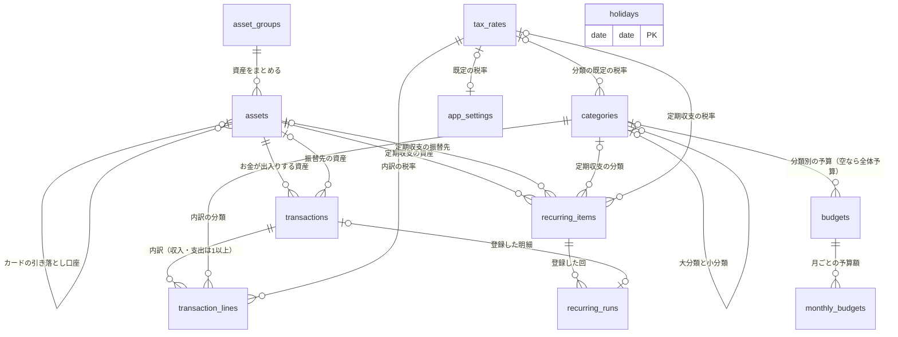

# DB 設計書：家計簿アプリ（BudgetManager）

| 項目 | 内容 |
|---|---|
| 文書番号 | 03 |
| 版数 | 0.1（作成中） |
| 作成日 | 2026-09-30 |
| 作成者 | major182 |
| 前提となる文書 | [01 要件定義書](01_requirements.md)、[02 技術選定書](02_tech-stack.md) |

---

## 目次

1. [設計方針](#1-設計方針)
2. [ER 図](#2-er-図)
3. [テーブル一覧](#3-テーブル一覧)
4. [テーブル定義](#4-テーブル定義)
5. 計算の仕方（作成中）
6. 業務ルールとの対応（作成中）
7. 初期データ（作成中）
8. [改訂履歴](#8-改訂履歴)

---

## 1. 設計方針

### 1.1 前提

- データベースは **MySQL 8.4**（技術選定書 5.6）。文字コードは `utf8mb4`
- テーブルは Django のモデル（Python のクラス）で定義し、マイグレーション（DB の構造を変更する仕組み）で作る。**この設計書が正**で、モデルはこれに合わせて書く

### 1.2 設計上の決定事項

| No | 決定事項 | 理由 |
|---|---|---|
| D-1 | **明細は「明細」と「明細の内訳」の2つのテーブル**で持つ。収入・支出は内訳を1行以上持ち、分類と税率は内訳ごとに持つ。振替は内訳を持たず、明細に振替先の資産を持つ | 収入・支出・振替を1つの一覧で日付順に並べやすい。内訳は「分類と税率の組み合わせ」の単位（BR-80） |
| D-2 | **金額は整数（`BIGINT`）で円を保存**する。**税率は `DECIMAL(4,1)`**（例：10.0、8.0） | 円は整数で扱う（BR-02）。整数で保存すれば誤差は出ない。税額の計算の途中だけ Python の `Decimal` を使う |
| D-3 | **資産の残高は保存しない**。必要なときに、開始残高と明細から計算する | 残高を保存すると、明細を直すたびに残高も直す必要があり、ずれの原因になる。件数（10年で約4万件）なら計算で足りる。性能（NF-PF-03）は実装時に測って確かめる |
| D-4 | **マスタ（分類・資産・税率など）は、どこからも使われていなければ削除できる**。明細または定期収支から使われていれば削除できず、代わりに「非表示」にする。**明細は削除すると本当に消える** | BR-33・44・77。定期収支から使われているマスタを消すと、次の自動登録が失敗するため、定期収支からの利用も「使用中」とみなす。明細を消すのは誤入力の取り消しなので、履歴は残さない |
| D-5 | **定期収支は内訳を1つだけ持つ**（分類と税率を1組） | 給料・家賃・サブスクなどは1つの分類で足りる。複数にすると画面と処理が複雑になる |
| D-6 | **テーブル名は英語の複数形で明示的に付ける**（例：`transactions`） | Django が自動で付ける名前（`アプリ名_モデル名`）は長く、設計書と対応が取りにくい |

### 1.3 そのほかの方針

| 項目 | 方針 | 理由 |
|---|---|---|
| 主キー | すべてのテーブルで `id`（`BIGINT` の連番）。祝日だけは日付を主キーにする | Django の標準（`BigAutoField`）に合わせる。祝日は日付で一意に決まる |
| 列名 | 英語の小文字とアンダースコア（例：`opening_balance`） | Python と MySQL の慣習に合わせる |
| 共通の列 | すべてのテーブルに `created_at`（作成日時）・`updated_at`（更新日時）を持つ | 不具合の調査で「いつ登録・変更されたか」を追えるようにする |
| 選択肢の値 | 種類（収入・支出・振替など）は、英語の短い文字列（例：`income`）で保存する | 数字（1・2・3）で保存すると、DB を直接見たときに意味が分からない |
| 並び順 | 利用者が並べ替えられるマスタには `sort_order`（整数）を持つ | 分類・資産などの並べ替え（F-CT-01・F-AS-01） |
| 外部キーの削除時の動き | 原則 **削除を禁止**（`PROTECT`）する。明細と内訳のように、親と一緒に消えるべきものだけ連動して削除（`CASCADE`）する | D-4 を DB の仕組みでも守り、アプリの不具合で使用中のマスタが消えるのを防ぐ |
| 設定 | 1行だけのテーブルに持つ | 利用者が1人なので、設定は1組しかない |

---

## 2. ER 図

テーブル同士の関係を示す。線の端の記号は、`||` が「ちょうど1つ」、`o|` が「0か1つ」、`o{` が「0以上」、`|{` が「1以上」を表す。

- `holidays`（祝日）はほかのテーブルと結びつかない。定期収支の日付の調整（BR-62）と、月の開始日の調整（BR-21）で参照する
- このほか、Django が自動で作るテーブル（`django_migrations`・`django_session` など）がある。本書の対象外とする

---

## 3. テーブル一覧

| No | テーブル名 | 名前 | 役割 | 件数の目安 | 要件の出典 |
|---|---|---|---|---|---|
| 1 | `app_settings` | 設定 | 通貨の表示・月の開始日・週の開始曜日・テーマ・消費税の既定値などを1行で持つ | 1 | F-CF-01〜05 |
| 2 | `tax_rates` | 税率 | 入力時に選ぶ税率 | 〜10 | BR-71、F-TR-01 |
| 3 | `categories` | 分類 | 収入・支出の大分類と小分類。既定の税率を持てる | 〜100 | BR-30〜34、BR-78 |
| 4 | `asset_groups` | 資産グループ | 資産の種類のまとまり（現金・銀行口座など） | 〜10 | BR-40 |
| 5 | `assets` | 資産 | お金の置き場所。クレジットカードは締め日・支払日・引き落とし口座を持つ | 〜30 | BR-40〜45 |
| 6 | `transactions` | 明細 | 1件の収入・支出・振替。金額（税込の合計、または振替額）を持つ | 年 3,000〜4,000 | BR-10〜15 |
| 7 | `transaction_lines` | 明細の内訳 | 分類と税率の組み合わせごとの金額（税抜・消費税・税込） | 年 4,000〜6,000 | BR-70〜80 |
| 8 | `budgets` | 予算 | 全体予算と大分類ごとの予算の基本額 | 〜30 | BR-50〜52 |
| 9 | `monthly_budgets` | 月別予算 | 特定の月だけ基本額から変えた予算額 | 〜400 | BR-51 |
| 10 | `recurring_items` | 定期収支 | 周期・土日祝日の扱いなど、自動登録のルール | 〜50 | BR-60〜65 |
| 11 | `recurring_runs` | 定期収支の登録履歴 | どの定期収支の、どの回を登録したか。二重登録を防ぐ | 年 〜600 | BR-64 |
| 12 | `holidays` | 祝日 | 日本の祝日（振替休日・国民の休日を含む） | 年 〜20 | IF-01、BT-02 |

### 3.1 補足：明細の金額を明細と内訳の両方に持つ理由

明細の `amount`（税込の合計）は、内訳の `amount_incl`（税込額）を合計すれば求められるため、**二重に持っている**ことになる。それでも明細に持つ理由は次のとおり。

- 振替は内訳を持たないため、振替額を置く場所が明細にしかない。収入・支出も同じ列に金額を持てば、一覧・残高の計算を1つのテーブルだけで行える
- 明細と内訳は必ず同時に保存する（1回の DB 更新処理の中で、両方を書き込む）。D-3 の残高と違い、**ほかの明細の変更に引きずられて直す必要がない**ため、ずれが起きにくい

ずれを防ぐため、明細と内訳の保存は必ずサービス層の1つの処理から行い、合計が一致することをテストで確かめる。

---

## 4. テーブル定義

### 4.0 表の見方

| 列の見出し | 意味 |
|---|---|
| 必須 | ○：値が必ず入る（NOT NULL）／空：値がない場合がある（NULL を許す） |
| 既定値 | 値を指定しなかったときに入る値 |
| 制約・説明 | 値の範囲、ほかのテーブルとの関係（→ 参照先）、意味 |

- **共通の列**：すべてのテーブルに次の3列がある（祝日は `id` の代わりに `date` が主キー）。各表では省略する

  | 列名 | 型 | 必須 | 説明 |
  |---|---|---|---|
  | `id` | BIGINT | ○ | 主キー。自動で連番を振る |
  | `created_at` | DATETIME(6) | ○ | 作成日時（自動で入る） |
  | `updated_at` | DATETIME(6) | ○ | 更新日時（自動で入る） |

- **外部キーの削除時の動き**：特に書いていないものは「削除を禁止」（1.3）
- **制約をどこで守るか**：「DB」は MySQL の制約（CHECK・UNIQUE・外部キー）で守る。「アプリ」は Django のフォームとサービス層で守る。
  外部キーの列を使う条件（例：振替なら振替先が必須）は、**MySQL が CHECK 制約で外部キーの列を扱える範囲に制限があるため、実装時に DB の制約にできるかを確かめる**。できない場合はアプリで守る
- **日の値の表し方**：「日」を表す列（締め日・引き落とし日・月の開始日）は、**1〜28 は日付、0 は月末**を表す。29〜31日は月によって存在しないため選べないようにし、代わりに「月末」を使う

### 4.1 `app_settings`（設定）

1行だけを持つ。`id` は常に 1。

| 列名 | 型 | 必須 | 既定値 | 制約・説明 | 出典 |
|---|---|---|---|---|---|
| `currency_symbol` | VARCHAR(10) | ○ | `yen_sign` | 通貨記号。`yen_sign`（¥）／`yen_text`（円）／`none`（なし） | F-CF-01 |
| `use_thousands_separator` | BOOLEAN | ○ | TRUE | 桁区切り（1,000）を付けるか | F-CF-01 |
| `month_start_day` | TINYINT | ○ | 1 | 月の開始日。0（月末）〜28 | BR-20 |
| `month_start_holiday_rule` | VARCHAR(10) | ○ | `none` | 開始日が土日祝日のとき。`none`（そのまま）／`previous`（前の平日）／`next`（次の平日） | BR-21 |
| `week_start` | VARCHAR(10) | ○ | `sunday` | 週の開始曜日。`sunday`／`monday` | BR-22 |
| `theme` | VARCHAR(10) | ○ | `system` | 画面のテーマ。`light`／`dark`／`system`（端末の設定に合わせる） | F-CF-04 |
| `tax_rounding` | VARCHAR(20) | ○ | `floor` | 消費税額の端数処理。`floor`（切り捨て）／`round_half_up`（四捨五入）／`ceiling`（切り上げ） | BR-74 |
| `default_tax_rate_id` | BIGINT | | | 分類に既定の税率がないときの初期表示（→ `tax_rates`） | BR-79 |
| `default_amount_input_type` | VARCHAR(20) | ○ | `tax_included` | 金額の入力の初期値。`tax_included`（税込）／`tax_excluded`（税抜） | BR-79 |

| 種類 | 内容 | どこで |
|---|---|---|
| CHECK | `id = 1`（2行目を作らせない） | DB |
| CHECK | `month_start_day` が 0〜28 | DB |

### 4.2 `tax_rates`（税率）

| 列名 | 型 | 必須 | 既定値 | 制約・説明 | 出典 |
|---|---|---|---|---|---|
| `name` | VARCHAR(50) | ○ | | 名前（例：標準税率 10%） | BR-71 |
| `rate` | DECIMAL(4,1) | ○ | | 税率（%）。0.0〜100.0 | BR-71 |
| `is_hidden` | BOOLEAN | ○ | FALSE | 非表示。入力時の選択肢に出さない | BR-77 |
| `sort_order` | INT | ○ | 0 | 並び順 | F-TR-01 |

| 種類 | 内容 | どこで |
|---|---|---|
| UNIQUE | `name` | DB |
| CHECK | `rate` が 0.0〜100.0 | DB |
| 削除 | 明細の内訳・定期収支・分類・設定から使われていれば削除できない | DB（外部キー）＋ アプリ（画面で理由を表示） |

### 4.3 `categories`（分類）

大分類と小分類を同じテーブルに持ち、`parent_id` が空なら大分類、入っていれば小分類とする。

| 列名 | 型 | 必須 | 既定値 | 制約・説明 | 出典 |
|---|---|---|---|---|---|
| `kind` | VARCHAR(10) | ○ | | `income`（収入用）／`expense`（支出用） | BR-30 |
| `name` | VARCHAR(50) | ○ | | 名前 | F-CT-01 |
| `parent_id` | BIGINT | | | 親の大分類（→ `categories`）。空なら大分類 | BR-31 |
| `default_tax_rate_id` | BIGINT | | | 既定の税率（→ `tax_rates`） | BR-78 |
| `is_hidden` | BOOLEAN | ○ | FALSE | 非表示 | BR-33 |
| `sort_order` | INT | ○ | 0 | 並び順（同じ親の中での順番） | F-CT-01 |

| 種類 | 内容 | どこで |
|---|---|---|
| CHECK | `kind` が `income`／`expense` のいずれか | DB |
| 一意 | 同じ種類・同じ親の中で `name` が重複しない | アプリ（大分類は `parent_id` が空のため、DB の一意制約では守れない ※1） |
| 階層 | 親は大分類でなければならない（小分類の下に作らない）。親と子の `kind` は同じ | アプリ（BR-31） |
| 移動 | 大分類を小分類へ移せるのは、小分類を持っていない場合のみ | アプリ（BR-32） |
| 削除 | 明細の内訳・定期収支・予算から使われている、または小分類を持っている分類は削除できない | DB（外部キー）＋ アプリ |
| インデックス | (`kind`, `parent_id`, `sort_order`)：分類の一覧を並び順で表示するため | DB |

※1 MySQL の一意制約は、空（NULL）の値どうしを「同じ値」とみなさない。そのため `parent_id` が空の行（大分類）どうしでは名前の重複を防げない。

### 4.4 `asset_groups`（資産グループ）

| 列名 | 型 | 必須 | 既定値 | 制約・説明 | 出典 |
|---|---|---|---|---|---|
| `name` | VARCHAR(50) | ○ | | 名前（例：銀行口座） | BR-40 |
| `sort_order` | INT | ○ | 0 | 並び順 | F-AS-02 |

| 種類 | 内容 | どこで |
|---|---|---|
| UNIQUE | `name` | DB |
| 削除 | 資産が属していれば削除できない | DB（外部キー） |

### 4.5 `assets`（資産）

| 列名 | 型 | 必須 | 既定値 | 制約・説明 | 出典 |
|---|---|---|---|---|---|
| `asset_group_id` | BIGINT | ○ | | 資産グループ（→ `asset_groups`） | BR-40 |
| `name` | VARCHAR(50) | ○ | | 名前（例：〇〇銀行） | F-AS-01 |
| `opening_balance` | BIGINT | ○ | 0 | 開始残高（円）。カードは未払い額をマイナスで入れる | BR-41、BR-42 |
| `is_credit_card` | BOOLEAN | ○ | FALSE | クレジットカードか。TRUE なら負債として扱う | BR-42 |
| `closing_day` | TINYINT | | | 締め日。0（月末）〜28。カードのみ | BR-43 |
| `payment_month_offset` | TINYINT | | | 引き落とし月。1（翌月）／2（翌々月）。カードのみ | BR-43 |
| `payment_day` | TINYINT | | | 引き落とし日。0（月末）〜28。カードのみ | BR-43 |
| `payment_account_id` | BIGINT | | | 引き落とし口座（→ `assets`）。カードのみ | BR-43 |
| `is_hidden` | BOOLEAN | ○ | FALSE | 非表示 | BR-44 |
| `sort_order` | INT | ○ | 0 | 並び順（同じ資産グループの中での順番） | F-AS-01 |

| 種類 | 内容 | どこで |
|---|---|---|
| UNIQUE | `name` | DB |
| CHECK | カードなら `closing_day`・`payment_month_offset`・`payment_day` がすべて入り、カード以外ならすべて空 | DB |
| CHECK | `closing_day`・`payment_day` が 0〜28、`payment_month_offset` が 1〜2 | DB |
| 必須 | カードなら `payment_account_id` が入り、カード以外なら空 | アプリ（外部キーの列のため。4.0 参照） |
| 引き落とし口座 | 自分自身・ほかのカードは選べない | アプリ |
| 削除 | 明細・定期収支から使われている、またはカードの引き落とし口座になっていれば削除できない | DB（外部キー）＋ アプリ |

### 4.6 `transactions`（明細）

| 列名 | 型 | 必須 | 既定値 | 制約・説明 | 出典 |
|---|---|---|---|---|---|
| `kind` | VARCHAR(10) | ○ | | `income`（収入）／`expense`（支出）／`transfer`（振替） | BR-10 |
| `date` | DATE | ○ | | 日付（日本時間） | BR-04 |
| `asset_id` | BIGINT | ○ | | 資産（→ `assets`）。収入は入金先、支出は出金元、振替は出金元 | BR-11、BR-13 |
| `transfer_to_asset_id` | BIGINT | | | 振替先の資産（→ `assets`）。振替のみ | BR-13 |
| `amount` | BIGINT | ○ | | 金額（円）。収入・支出は内訳の税込額の合計、振替は振替額（3.1） | BR-03、BR-80 |
| `amount_input_type` | VARCHAR(20) | | | 金額を税込で入れたか税抜で入れたか。`tax_included`／`tax_excluded`。振替は空 | BR-72 |
| `description` | VARCHAR(100) | ○ | 空文字 | 内容（例：昼食）。入力の補完に使う | F-TX-01、F-TX-05 |
| `memo` | VARCHAR(500) | ○ | 空文字 | メモ | F-TX-01 |
| `source` | VARCHAR(10) | ○ | `manual` | 登録元。`manual`（手入力）／`recurring`（定期収支）／`csv`（CSV 取り込み） | 要件定義書 5.1 |

| 種類 | 内容 | どこで |
|---|---|---|
| CHECK | `kind` が3つのいずれか | DB |
| CHECK | `amount` が −99,999,999〜99,999,999 で、0 ではない | DB（BR-03） |
| CHECK | 収入・振替なら `amount` がプラス（マイナスは支出だけ） | DB（BR-03、BR-12） |
| CHECK | 振替なら `amount_input_type` が空、収入・支出なら入っている | DB |
| 必須 | 振替なら `transfer_to_asset_id` が入り、収入・支出なら空 | アプリ（外部キーの列のため） |
| 振替 | `asset_id` と `transfer_to_asset_id` が違う資産 | アプリ（BR-13） |
| 内訳 | 収入・支出は内訳が1行以上あり、`amount` が内訳の `amount_incl` の合計と一致する。振替は内訳を持たない | アプリ（3.1） |
| インデックス | (`date`)：期間での一覧・集計 | DB |
| インデックス | (`asset_id`, `date`)・(`transfer_to_asset_id`, `date`)：資産ごとの明細・残高の計算 | DB |
| インデックス | (`description`)：入力の補完（前方一致） | DB |

### 4.7 `transaction_lines`（明細の内訳）

| 列名 | 型 | 必須 | 既定値 | 制約・説明 | 出典 |
|---|---|---|---|---|---|
| `transaction_id` | BIGINT | ○ | | 明細（→ `transactions`）。**明細を削除すると一緒に削除する** | BR-80 |
| `category_id` | BIGINT | ○ | | 分類（→ `categories`）。大分類・小分類のどちらも指定できる | BR-11、BR-80 |
| `tax_rate_id` | BIGINT | ○ | | 税率（→ `tax_rates`） | BR-70 |
| `tax_rate_value` | DECIMAL(4,1) | ○ | | 登録時点の税率の値（例：10.0）。マスタを変えても変わらない | BR-76 |
| `amount_excl` | BIGINT | ○ | | 税抜額（円） | BR-72 |
| `tax_amount` | BIGINT | ○ | | 消費税額（円） | BR-72〜74 |
| `amount_incl` | BIGINT | ○ | | 税込額（円） | BR-72 |
| `sort_order` | INT | ○ | 0 | 明細の中での表示順 | F-TX-08 |

| 種類 | 内容 | どこで |
|---|---|---|
| CHECK | `amount_incl = amount_excl + tax_amount` | DB |
| CHECK | `tax_rate_value` が 0.0〜100.0 | DB |
| 分類 | 明細の種類と分類の `kind` が一致する（収入の明細に支出用の分類は使えない） | アプリ（BR-30） |
| 税額 | 税額は同じ税率の内訳を合計してから1回だけ端数処理する（計算の仕方は5章） | アプリ（BR-74） |
| インデックス | (`category_id`)：分類別の集計・予算の消化額 | DB |

### 4.8 `budgets`（予算）

| 列名 | 型 | 必須 | 既定値 | 制約・説明 | 出典 |
|---|---|---|---|---|---|
| `category_id` | BIGINT | | | 対象の支出の大分類（→ `categories`）。**空なら全体予算** | BR-50 |
| `base_amount` | BIGINT | ○ | | 基本額（円）。0 以上 | BR-51 |

| 種類 | 内容 | どこで |
|---|---|---|
| CHECK | `base_amount` が 0 以上 | DB |
| UNIQUE | `category_id`（同じ分類の予算は1つ） | DB |
| 全体予算 | 全体予算（`category_id` が空）は1つだけ | アプリ（※1 と同じ理由で DB では守れない） |
| 分類 | 支出用の大分類だけを選べる | アプリ（BR-50） |

### 4.9 `monthly_budgets`（月別予算）

| 列名 | 型 | 必須 | 既定値 | 制約・説明 | 出典 |
|---|---|---|---|---|---|
| `budget_id` | BIGINT | ○ | | 予算（→ `budgets`）。**予算を削除すると一緒に削除する** | BR-51 |
| `year_month` | DATE | ○ | | 対象の年月。**その月の1日**で表す（例：2026年10月 → 2026-10-01）。月の開始日（BR-20）を変えても、対象の「月」は変わらない | BR-51 |
| `amount` | BIGINT | ○ | | その月の予算額（円）。0 以上 | BR-51 |

| 種類 | 内容 | どこで |
|---|---|---|
| UNIQUE | (`budget_id`, `year_month`) | DB |
| CHECK | `amount` が 0 以上、`year_month` の日が 1 | DB |

### 4.10 `recurring_items`（定期収支）

| 列名 | 型 | 必須 | 既定値 | 制約・説明 | 出典 |
|---|---|---|---|---|---|
| `kind` | VARCHAR(10) | ○ | | `income`／`expense`／`transfer` | BR-60 |
| `asset_id` | BIGINT | ○ | | 資産（→ `assets`） | BR-60 |
| `transfer_to_asset_id` | BIGINT | | | 振替先の資産（→ `assets`）。振替のみ | BR-60 |
| `category_id` | BIGINT | | | 分類（→ `categories`）。収入・支出のみ | BR-60、D-5 |
| `tax_rate_id` | BIGINT | | | 税率（→ `tax_rates`）。収入・支出のみ。登録する時点の税率の値で計算する | BR-60、BR-76 |
| `amount_input_type` | VARCHAR(20) | | | `tax_included`／`tax_excluded`。収入・支出のみ | BR-60 |
| `amount` | BIGINT | ○ | | 入力する金額（円）。税込・税抜は `amount_input_type` に従う | BR-60 |
| `description` | VARCHAR(100) | ○ | 空文字 | 内容（登録する明細の内容になる） | BR-60 |
| `memo` | VARCHAR(500) | ○ | 空文字 | メモ（登録する明細のメモになる） | BR-60 |
| `frequency` | VARCHAR(10) | ○ | | 周期。`monthly`（毎月◯日）／`month_end`（毎月末）／`weekly`（毎週◯曜日）／`yearly`（毎年◯月◯日） | BR-61 |
| `day_of_month` | TINYINT | | | 日（1〜31）。`monthly`・`yearly` のみ。その月にない日は末日にする | BR-61 |
| `weekday` | TINYINT | | | 曜日（0＝月曜〜6＝日曜）。`weekly` のみ | BR-61 |
| `month` | TINYINT | | | 月（1〜12）。`yearly` のみ | BR-61 |
| `holiday_rule` | VARCHAR(10) | ○ | `none` | 登録日が土日祝日のとき。`none`（そのまま）／`previous`（前営業日）／`next`（後営業日） | BR-62 |
| `start_date` | DATE | ○ | | 開始日 | BR-60 |
| `end_date` | DATE | | | 終了日（空なら終了しない） | BR-60 |

| 種類 | 内容 | どこで |
|---|---|---|
| CHECK | `frequency` に応じて必要な列だけが入る（例：`weekly` なら `weekday` だけ） | DB |
| CHECK | `day_of_month` が 1〜31、`weekday` が 0〜6、`month` が 1〜12 | DB |
| CHECK | `amount` が 1〜99,999,999（定期収支ではマイナス支出を扱わない） | DB |
| CHECK | `end_date` が空か、`start_date` 以降 | DB |
| CHECK | 振替なら `amount_input_type` が空、収入・支出なら入っている | DB |
| 必須 | 振替なら `transfer_to_asset_id` が入り、`category_id`・`tax_rate_id` が空。収入・支出ならその逆 | アプリ（外部キーの列のため） |

- `day_of_month` は、ほかの「日」の列と違って 29〜31 も選べる。「毎月31日」を「その月の末日」として扱うため（BR-61）
- 定期収支ではマイナス支出を扱わない。返品・払い戻しは定期的に発生するものではないため

### 4.11 `recurring_runs`（定期収支の登録履歴）

定期収支の各回を登録したことを記録し、**同じ回の二重登録を防ぐ**（BR-64）。

| 列名 | 型 | 必須 | 既定値 | 制約・説明 | 出典 |
|---|---|---|---|---|---|
| `recurring_item_id` | BIGINT | ○ | | 定期収支（→ `recurring_items`）。**定期収支を削除すると一緒に削除する** | BR-64 |
| `scheduled_date` | DATE | ○ | | 本来の登録日（土日祝日の調整の前） | BR-64 |
| `registered_date` | DATE | ○ | | 実際に登録した明細の日付（調整の後） | BR-62 |
| `transaction_id` | BIGINT | | | 登録した明細（→ `transactions`）。**明細が削除されたら空にする** | BR-65 |

| 種類 | 内容 | どこで |
|---|---|---|
| UNIQUE | (`recurring_item_id`, `scheduled_date`)：同じ回を二度登録しない | DB（BR-64） |

- 本来の登録日（調整の前）で一意にする。調整後の日付で一意にすると、前後の回の調整後の日付が重なった場合に区別できない
- 自動登録された明細を利用者が削除しても、履歴は残る（`transaction_id` だけが空になる）。そのため、翌日の実行で同じ回が再び登録されることはない（BR-65）

### 4.12 `holidays`（祝日）

| 列名 | 型 | 必須 | 既定値 | 制約・説明 | 出典 |
|---|---|---|---|---|---|
| `date` | DATE | ○ | | 日付。**主キー** | IF-01 |
| `name` | VARCHAR(50) | ○ | | 祝日の名前（例：元日） | IF-01 |

- 振替休日・国民の休日も1行として持つ（内閣府の CSV に含まれる）
- 年末年始（12/31〜1/3）は祝日ではないため、このテーブルには入れない。営業日の判定（BR-62）の中で、アプリが別に扱う

---

## 8. 改訂履歴

| 版数 | 日付 | 内容 |
|---|---|---|
| 0.1 | 2026-09-30 | 作成開始（設計方針・ER 図・テーブル一覧・テーブル定義） |
