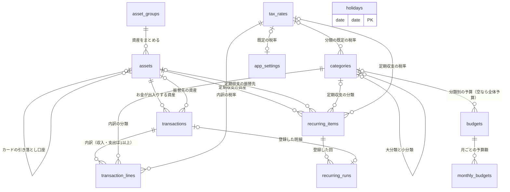

# DB 設計書：家計簿アプリ（BudgetManager）

| 項目 | 内容 |
|---|---|
| 文書番号 | 03 |
| 版数 | 0.1（作成中） |
| 作成日 | 2026-09-30 |
| 作成者 | major182 |
| 前提となる文書 | [01 要件定義書](01_requirements.md)、[02 技術選定書](02_tech-stack.md) |

---

## 目次

1. [設計方針](#1-設計方針)
2. [ER 図](#2-er-図)
3. [テーブル一覧](#3-テーブル一覧)
4. テーブル定義（作成中）
5. 計算の仕方（作成中）
6. 業務ルールとの対応（作成中）
7. 初期データ（作成中）
8. [改訂履歴](#8-改訂履歴)

---

## 1. 設計方針

### 1.1 前提

- データベースは **MySQL 8.4**（技術選定書 5.6）。文字コードは `utf8mb4`
- テーブルは Django のモデル（Python のクラス）で定義し、マイグレーション（DB の構造を変更する仕組み）で作る。**この設計書が正**で、モデルはこれに合わせて書く

### 1.2 設計上の決定事項

| No | 決定事項 | 理由 |
|---|---|---|
| D-1 | **明細は「明細」と「明細の内訳」の2つのテーブル**で持つ。収入・支出は内訳を1行以上持ち、分類と税率は内訳ごとに持つ。振替は内訳を持たず、明細に振替先の資産を持つ | 収入・支出・振替を1つの一覧で日付順に並べやすい。内訳は「分類と税率の組み合わせ」の単位（BR-80） |
| D-2 | **金額は整数（`BIGINT`）で円を保存**する。**税率は `DECIMAL(4,1)`**（例：10.0、8.0） | 円は整数で扱う（BR-02）。整数で保存すれば誤差は出ない。税額の計算の途中だけ Python の `Decimal` を使う |
| D-3 | **資産の残高は保存しない**。必要なときに、開始残高と明細から計算する | 残高を保存すると、明細を直すたびに残高も直す必要があり、ずれの原因になる。件数（10年で約4万件）なら計算で足りる。性能（NF-PF-03）は実装時に測って確かめる |
| D-4 | **マスタ（分類・資産・税率など）は、どこからも使われていなければ削除できる**。明細または定期収支から使われていれば削除できず、代わりに「非表示」にする。**明細は削除すると本当に消える** | BR-33・44・77。定期収支から使われているマスタを消すと、次の自動登録が失敗するため、定期収支からの利用も「使用中」とみなす。明細を消すのは誤入力の取り消しなので、履歴は残さない |
| D-5 | **定期収支は内訳を1つだけ持つ**（分類と税率を1組） | 給料・家賃・サブスクなどは1つの分類で足りる。複数にすると画面と処理が複雑になる |
| D-6 | **テーブル名は英語の複数形で明示的に付ける**（例：`transactions`） | Django が自動で付ける名前（`アプリ名_モデル名`）は長く、設計書と対応が取りにくい |

### 1.3 そのほかの方針

| 項目 | 方針 | 理由 |
|---|---|---|
| 主キー | すべてのテーブルで `id`（`BIGINT` の連番）。祝日だけは日付を主キーにする | Django の標準（`BigAutoField`）に合わせる。祝日は日付で一意に決まる |
| 列名 | 英語の小文字とアンダースコア（例：`opening_balance`） | Python と MySQL の慣習に合わせる |
| 共通の列 | すべてのテーブルに `created_at`（作成日時）・`updated_at`（更新日時）を持つ | 不具合の調査で「いつ登録・変更されたか」を追えるようにする |
| 選択肢の値 | 種類（収入・支出・振替など）は、英語の短い文字列（例：`income`）で保存する | 数字（1・2・3）で保存すると、DB を直接見たときに意味が分からない |
| 並び順 | 利用者が並べ替えられるマスタには `sort_order`（整数）を持つ | 分類・資産などの並べ替え（F-CT-01・F-AS-01） |
| 外部キーの削除時の動き | 原則 **削除を禁止**（`PROTECT`）する。明細と内訳のように、親と一緒に消えるべきものだけ連動して削除（`CASCADE`）する | D-4 を DB の仕組みでも守り、アプリの不具合で使用中のマスタが消えるのを防ぐ |
| 設定 | 1行だけのテーブルに持つ | 利用者が1人なので、設定は1組しかない |

---

## 2. ER 図

テーブル同士の関係を示す。線の端の記号は、`||` が「ちょうど1つ」、`o|` が「0か1つ」、`o{` が「0以上」、`|{` が「1以上」を表す。

- `holidays`（祝日）はほかのテーブルと結びつかない。定期収支の日付の調整（BR-62）と、月の開始日の調整（BR-21）で参照する
- このほか、Django が自動で作るテーブル（`django_migrations`・`django_session` など）がある。本書の対象外とする

---

## 3. テーブル一覧

| No | テーブル名 | 名前 | 役割 | 件数の目安 | 要件の出典 |
|---|---|---|---|---|---|
| 1 | `app_settings` | 設定 | 通貨の表示・月の開始日・週の開始曜日・テーマ・消費税の既定値などを1行で持つ | 1 | F-CF-01〜05 |
| 2 | `tax_rates` | 税率 | 入力時に選ぶ税率 | 〜10 | BR-71、F-TR-01 |
| 3 | `categories` | 分類 | 収入・支出の大分類と小分類。既定の税率を持てる | 〜100 | BR-30〜34、BR-78 |
| 4 | `asset_groups` | 資産グループ | 資産の種類のまとまり（現金・銀行口座など） | 〜10 | BR-40 |
| 5 | `assets` | 資産 | お金の置き場所。クレジットカードは締め日・支払日・引き落とし口座を持つ | 〜30 | BR-40〜45 |
| 6 | `transactions` | 明細 | 1件の収入・支出・振替。金額（税込の合計、または振替額）を持つ | 年 3,000〜4,000 | BR-10〜15 |
| 7 | `transaction_lines` | 明細の内訳 | 分類と税率の組み合わせごとの金額（税抜・消費税・税込） | 年 4,000〜6,000 | BR-70〜80 |
| 8 | `budgets` | 予算 | 全体予算と大分類ごとの予算の基本額 | 〜30 | BR-50〜52 |
| 9 | `monthly_budgets` | 月別予算 | 特定の月だけ基本額から変えた予算額 | 〜400 | BR-51 |
| 10 | `recurring_items` | 定期収支 | 周期・土日祝日の扱いなど、自動登録のルール | 〜50 | BR-60〜65 |
| 11 | `recurring_runs` | 定期収支の登録履歴 | どの定期収支の、どの回を登録したか。二重登録を防ぐ | 年 〜600 | BR-64 |
| 12 | `holidays` | 祝日 | 日本の祝日（振替休日・国民の休日を含む） | 年 〜20 | IF-01、BT-02 |

### 3.1 補足：明細の金額を明細と内訳の両方に持つ理由

明細の `amount`（税込の合計）は、内訳の `amount_incl`（税込額）を合計すれば求められるため、**二重に持っている**ことになる。それでも明細に持つ理由は次のとおり。

- 振替は内訳を持たないため、振替額を置く場所が明細にしかない。収入・支出も同じ列に金額を持てば、一覧・残高の計算を1つのテーブルだけで行える
- 明細と内訳は必ず同時に保存する（1回の DB 更新処理の中で、両方を書き込む）。D-3 の残高と違い、**ほかの明細の変更に引きずられて直す必要がない**ため、ずれが起きにくい

ずれを防ぐため、明細と内訳の保存は必ずサービス層の1つの処理から行い、合計が一致することをテストで確かめる。

---

## 8. 改訂履歴

| 版数 | 日付 | 内容 |
|---|---|---|
| 0.1 | 2026-09-30 | 作成開始（設計方針・ER 図・テーブル一覧） |
