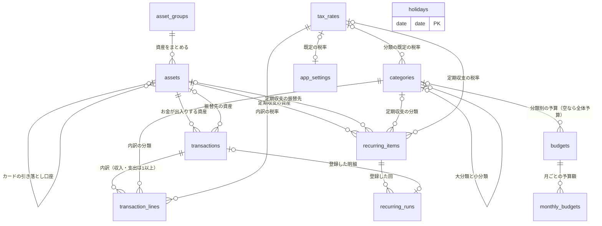

# DB 設計書：家計簿アプリ（BudgetManager）

| 項目 | 内容 |
|---|---|
| 文書番号 | 03 |
| 版数 | 0.2 |
| 作成日 | 2026-09-30 |
| 作成者 | major182 |
| 前提となる文書 | [01 要件定義書](01_requirements.md)、[02 技術選定書](02_tech-stack.md) |

---

## 目次

1. [設計方針](#1-設計方針)
2. [ER 図](#2-er-図)
3. [テーブル一覧](#3-テーブル一覧)
4. [テーブル定義](#4-テーブル定義)
5. [計算の仕方](#5-計算の仕方)
6. [業務ルールとの対応](#6-業務ルールとの対応)
7. [初期データ](#7-初期データ)
8. [改訂履歴](#8-改訂履歴)

---

## 1. 設計方針

### 1.1 前提

- データベースは **MySQL 8.4**（技術選定書 5.6）。文字コードは `utf8mb4`
- テーブルは Django のモデル（Python のクラス）で定義し、マイグレーション（DB の構造を変更する仕組み）で作る。**この設計書が正**で、モデルはこれに合わせて書く

### 1.2 設計上の決定事項

| No | 決定事項 | 理由 |
|---|---|---|
| D-1 | **明細は「明細」と「明細の内訳」の2つのテーブル**で持つ。収入・支出は内訳を1行以上持ち、分類と税率は内訳ごとに持つ。振替は内訳を持たず、明細に振替先の資産を持つ | 収入・支出・振替を1つの一覧で日付順に並べやすい。内訳は「分類と税率の組み合わせ」の単位（BR-80） |
| D-2 | **金額は整数（`BIGINT`）で円を保存**する。**税率は `DECIMAL(4,1)`**（例：10.0、8.0） | 円は整数で扱う（BR-02）。整数で保存すれば誤差は出ない。税額の計算の途中だけ Python の `Decimal` を使う |
| D-3 | **資産の残高は保存しない**。必要なときに、開始残高と明細から計算する | 残高を保存すると、明細を直すたびに残高も直す必要があり、ずれの原因になる。件数（10年で約4万件）なら計算で足りる。性能（NF-PF-03）は実装時に測って確かめる |
| D-4 | **マスタ（分類・資産・税率など）は、どこからも使われていなければ削除できる**。明細または定期収支から使われていれば削除できず、代わりに「非表示」にする。**明細は削除すると本当に消える** | BR-33・44・77。定期収支から使われているマスタを消すと、次の自動登録が失敗するため、定期収支からの利用も「使用中」とみなす。明細を消すのは誤入力の取り消しなので、履歴は残さない |
| D-5 | **定期収支は内訳を1つだけ持つ**（分類と税率を1組） | 給料・家賃・サブスクなどは1つの分類で足りる。複数にすると画面と処理が複雑になる |
| D-6 | **テーブル名は英語の複数形で明示的に付ける**（例：`transactions`） | Django が自動で付ける名前（`アプリ名_モデル名`）は長く、設計書と対応が取りにくい |

### 1.3 そのほかの方針

| 項目 | 方針 | 理由 |
|---|---|---|
| 主キー | すべてのテーブルで `id`（`BIGINT` の連番）。例外として、祝日は日付を主キーにし、設定は常に 1 の `id`（SMALLINT・自動採番しない。4.1）にする | Django の標準（`BigAutoField`）に合わせる。祝日は日付で一意に決まる。設定は CHECK 制約で1行に限るため |
| 列名 | 英語の小文字とアンダースコア（例：`opening_balance`） | Python と MySQL の慣習に合わせる |
| 共通の列 | すべてのテーブルに `created_at`（作成日時）・`updated_at`（更新日時）を持つ | 不具合の調査で「いつ登録・変更されたか」を追えるようにする |
| 選択肢の値 | 種類（収入・支出・振替など）は、英語の短い文字列（例：`income`）で保存する | 数字（1・2・3）で保存すると、DB を直接見たときに意味が分からない |
| 並び順 | 利用者が並べ替えられるマスタには `sort_order`（整数）を持つ | 分類・資産などの並べ替え（F-CT-01・F-AS-01） |
| 外部キーの削除時の動き | 原則 **削除を禁止**（`PROTECT`）する。明細と内訳のように、親と一緒に消えるべきものだけ連動して削除（`CASCADE`）する | D-4 を DB の仕組みでも守り、アプリの不具合で使用中のマスタが消えるのを防ぐ |
| 設定 | 1行だけのテーブルに持つ | 利用者が1人なので、設定は1組しかない |

---

## 2. ER 図

テーブル同士の関係を示す。線の端の記号は、`||` が「ちょうど1つ」、`o|` が「0か1つ」、`o{` が「0以上」、`|{` が「1以上」を表す。



- `holidays`（祝日）はほかのテーブルと結びつかない。定期収支の日付の調整（BR-62）と、月の開始日の調整（BR-21）で参照する
- このほか、Django が自動で作るテーブル（`django_migrations`・`django_session` など）がある。本書の対象外とする

---

## 3. テーブル一覧

| No | テーブル名 | 名前 | 役割 | 件数の目安 | 要件の出典 |
|---|---|---|---|---|---|
| 1 | `app_settings` | 設定 | 通貨の表示・月の開始日・週の開始曜日・テーマ・消費税の既定値などを1行で持つ | 1 | F-CF-01〜05 |
| 2 | `tax_rates` | 税率 | 入力時に選ぶ税率 | 〜10 | BR-71、F-TR-01 |
| 3 | `categories` | 分類 | 収入・支出の大分類と小分類。既定の税率を持てる | 〜100 | BR-30〜34、BR-78 |
| 4 | `asset_groups` | 資産グループ | 資産の種類のまとまり（現金・銀行口座など） | 〜10 | BR-40 |
| 5 | `assets` | 資産 | お金の置き場所。クレジットカードは締め日・支払日・引き落とし口座を持つ | 〜30 | BR-40〜45 |
| 6 | `transactions` | 明細 | 1件の収入・支出・振替。金額（税込の合計、または振替額）を持つ | 年 3,000〜4,000 | BR-10〜15 |
| 7 | `transaction_lines` | 明細の内訳 | 分類と税率の組み合わせごとの金額（税抜・消費税・税込） | 年 4,000〜6,000 | BR-70〜80 |
| 8 | `budgets` | 予算 | 全体予算と大分類ごとの予算の基本額 | 〜30 | BR-50〜52 |
| 9 | `monthly_budgets` | 月別予算 | 特定の月だけ基本額から変えた予算額 | 〜400 | BR-51 |
| 10 | `recurring_items` | 定期収支 | 周期・土日祝日の扱いなど、自動登録のルール | 〜50 | BR-60〜65 |
| 11 | `recurring_runs` | 定期収支の登録履歴 | どの定期収支の、どの回を登録したか。二重登録を防ぐ | 年 〜600 | BR-64 |
| 12 | `holidays` | 祝日 | 日本の祝日（振替休日・国民の休日を含む） | 年 〜20 | IF-01、BT-02 |

### 3.1 補足：明細の金額を明細と内訳の両方に持つ理由

明細の `amount`（税込の合計）は、内訳の `amount_incl`（税込額）を合計すれば求められるため、**二重に持っている**ことになる。それでも明細に持つ理由は次のとおり。

- 振替は内訳を持たないため、振替額を置く場所が明細にしかない。収入・支出も同じ列に金額を持てば、一覧・残高の計算を1つのテーブルだけで行える
- 明細と内訳は必ず同時に保存する（1回の DB 更新処理の中で、両方を書き込む）。D-3 の残高と違い、**ほかの明細の変更に引きずられて直す必要がない**ため、ずれが起きにくい

ずれを防ぐため、明細と内訳の保存は必ずサービス層の1つの処理から行い、合計が一致することをテストで確かめる。

---

## 4. テーブル定義

### 4.0 表の見方

| 列の見出し | 意味 |
|---|---|
| 必須 | ○：値が必ず入る（NOT NULL）／空：値がない場合がある（NULL を許す） |
| 既定値 | 値を指定しなかったときに入る値 |
| 制約・説明 | 値の範囲、ほかのテーブルとの関係（→ 参照先）、意味 |

- **共通の列**：すべてのテーブルに次の3列がある（祝日は `id` の代わりに `date` が主キー）。各表では省略する

  | 列名 | 型 | 必須 | 説明 |
  |---|---|---|---|
  | `id` | BIGINT | ○ | 主キー。自動で連番を振る |
  | `created_at` | DATETIME(6) | ○ | 作成日時（自動で入る） |
  | `updated_at` | DATETIME(6) | ○ | 更新日時（自動で入る） |

- **外部キーの削除時の動き**：特に書いていないものは「削除を禁止」（1.3）
- **制約をどこで守るか**：「DB」は MySQL の制約（CHECK・UNIQUE・外部キー）で守る。「アプリ」は Django のフォームとサービス層で守る。
  外部キーの列を使う条件（例：振替なら振替先が必須）も、**DB の CHECK 制約で守る**。MySQL は、削除時の動き（ON DELETE など）を指定した外部キーの列を CHECK 制約で使えないが、Django は削除時の動き（1.3）を DB ではなくアプリで処理し、DB の外部キーには指定しないため、制約を作れる（MySQL 8.4.11 で確認済み）
- **日の値の表し方**：「日」を表す列（締め日・引き落とし日・月の開始日）は、**1〜30 は日付、0 は月末**を表す。**選んだ日がその月にない場合（例：2月の30日、うるう年でない2月の29日）は、その月の末日として扱う**。31日は「月末」と同じ意味になるため、選択肢には出さない

### 4.1 `app_settings`（設定）

1行だけを持つ。`id` は常に 1。

| 列名 | 型 | 必須 | 既定値 | 制約・説明 | 出典 |
|---|---|---|---|---|---|
| `currency_symbol` | VARCHAR(10) | ○ | `yen_sign` | 通貨記号。`yen_sign`（¥）／`yen_text`（円）／`none`（なし） | F-CF-01 |
| `use_thousands_separator` | BOOLEAN | ○ | TRUE | 桁区切り（1,000）を付けるか | F-CF-01 |
| `month_start_day` | SMALLINT | ○ | 1 | 月の開始日。0（月末）〜30 | BR-20 |
| `month_start_holiday_rule` | VARCHAR(10) | ○ | `none` | 開始日が土日祝日のとき。`none`（そのまま）／`previous`（前の平日）／`next`（次の平日） | BR-21 |
| `week_start` | VARCHAR(10) | ○ | `sunday` | 週の開始曜日。`sunday`／`monday` | BR-22 |
| `theme` | VARCHAR(10) | ○ | `system` | 画面のテーマ。`light`／`dark`／`system`（端末の設定に合わせる） | F-CF-04 |
| `tax_rounding` | VARCHAR(20) | ○ | `floor` | 消費税額の端数処理。`floor`（切り捨て）／`round_half_up`（四捨五入）／`ceiling`（切り上げ） | BR-74 |
| `default_tax_rate_id` | BIGINT | | | 分類に既定の税率がないときの初期表示（→ `tax_rates`） | BR-79 |
| `default_amount_input_type` | VARCHAR(20) | ○ | `tax_included` | 金額の入力の初期値。`tax_included`（税込）／`tax_excluded`（税抜） | BR-79 |

| 種類 | 内容 | どこで |
|---|---|---|
| CHECK | `id = 1`（2行目を作らせない）。MySQL は自動採番の列を CHECK 制約で使えないため、**この表の `id` だけは自動採番にせず、既定値 1 の SMALLINT にする** | DB |
| CHECK | `month_start_day` が 0〜30 | DB |

### 4.2 `tax_rates`（税率）

| 列名 | 型 | 必須 | 既定値 | 制約・説明 | 出典 |
|---|---|---|---|---|---|
| `name` | VARCHAR(50) | ○ | | 名前（例：標準税率 10%） | BR-71 |
| `rate` | DECIMAL(4,1) | ○ | | 税率（%）。0.0〜100.0 | BR-71 |
| `is_hidden` | BOOLEAN | ○ | FALSE | 非表示。入力時の選択肢に出さない | BR-77 |
| `sort_order` | INT | ○ | 0 | 並び順 | F-TR-01 |

| 種類 | 内容 | どこで |
|---|---|---|
| UNIQUE | `name` | DB |
| CHECK | `rate` が 0.0〜100.0 | DB |
| 削除 | 明細の内訳・定期収支・分類・設定から使われていれば削除できない | DB（外部キー）＋ アプリ（画面で理由を表示） |

### 4.3 `categories`（分類）

大分類と小分類を同じテーブルに持ち、`parent_id` が空なら大分類、入っていれば小分類とする。

| 列名 | 型 | 必須 | 既定値 | 制約・説明 | 出典 |
|---|---|---|---|---|---|
| `kind` | VARCHAR(10) | ○ | | `income`（収入用）／`expense`（支出用） | BR-30 |
| `name` | VARCHAR(50) | ○ | | 名前 | F-CT-01 |
| `parent_id` | BIGINT | | | 親の大分類（→ `categories`）。空なら大分類 | BR-31 |
| `default_tax_rate_id` | BIGINT | | | 既定の税率（→ `tax_rates`） | BR-78 |
| `is_hidden` | BOOLEAN | ○ | FALSE | 非表示 | BR-33 |
| `sort_order` | INT | ○ | 0 | 並び順（同じ親の中での順番） | F-CT-01 |

| 種類 | 内容 | どこで |
|---|---|---|
| CHECK | `kind` が `income`／`expense` のいずれか | DB |
| 一意 | 同じ種類・同じ親の中で `name` が重複しない | アプリ（大分類は `parent_id` が空のため、DB の一意制約では守れない ※1） |
| 階層 | 親は大分類でなければならない（小分類の下に作らない）。親と子の `kind` は同じ | アプリ（BR-31） |
| 移動 | 大分類を小分類へ移せるのは、小分類を持っていない場合のみ | アプリ（BR-32） |
| 削除 | 明細の内訳・定期収支・予算から使われている、または小分類を持っている分類は削除できない | DB（外部キー）＋ アプリ |
| インデックス | (`kind`, `parent_id`, `sort_order`)：分類の一覧を並び順で表示するため | DB |

※1 MySQL の一意制約は、空（NULL）の値どうしを「同じ値」とみなさない。そのため `parent_id` が空の行（大分類）どうしでは名前の重複を防げない。

### 4.4 `asset_groups`（資産グループ）

| 列名 | 型 | 必須 | 既定値 | 制約・説明 | 出典 |
|---|---|---|---|---|---|
| `name` | VARCHAR(50) | ○ | | 名前（例：銀行口座） | BR-40 |
| `sort_order` | INT | ○ | 0 | 並び順 | F-AS-02 |

| 種類 | 内容 | どこで |
|---|---|---|
| UNIQUE | `name` | DB |
| 削除 | 資産が属していれば削除できない | DB（外部キー） |

### 4.5 `assets`（資産）

| 列名 | 型 | 必須 | 既定値 | 制約・説明 | 出典 |
|---|---|---|---|---|---|
| `asset_group_id` | BIGINT | ○ | | 資産グループ（→ `asset_groups`） | BR-40 |
| `name` | VARCHAR(50) | ○ | | 名前（例：〇〇銀行） | F-AS-01 |
| `opening_balance` | BIGINT | ○ | 0 | 開始残高（円）。カードは未払い額をマイナスで入れる | BR-41、BR-42 |
| `is_credit_card` | BOOLEAN | ○ | FALSE | クレジットカードか。TRUE なら負債として扱う | BR-42 |
| `closing_day` | SMALLINT | | | 締め日。0（月末）〜30。カードのみ | BR-43 |
| `payment_month_offset` | SMALLINT | | | 引き落とし月。1（翌月）／2（翌々月）。カードのみ | BR-43 |
| `payment_day` | SMALLINT | | | 引き落とし日。0（月末）〜30。カードのみ | BR-43 |
| `payment_account_id` | BIGINT | | | 引き落とし口座（→ `assets`）。カードのみ | BR-43 |
| `is_hidden` | BOOLEAN | ○ | FALSE | 非表示 | BR-44 |
| `sort_order` | INT | ○ | 0 | 並び順（同じ資産グループの中での順番） | F-AS-01 |

| 種類 | 内容 | どこで |
|---|---|---|
| UNIQUE | `name` | DB |
| CHECK | カードなら `closing_day`・`payment_month_offset`・`payment_day` がすべて入り、カード以外ならすべて空 | DB |
| CHECK | `closing_day`・`payment_day` が 0〜30、`payment_month_offset` が 1〜2 | DB |
| 必須 | カードなら `payment_account_id` が入り、カード以外なら空 | DB（上の CHECK に含める） |
| 引き落とし口座 | 自分自身・ほかのカードは選べない | アプリ |
| 削除 | 明細・定期収支から使われている、またはカードの引き落とし口座になっていれば削除できない | DB（外部キー）＋ アプリ |

### 4.6 `transactions`（明細）

| 列名 | 型 | 必須 | 既定値 | 制約・説明 | 出典 |
|---|---|---|---|---|---|
| `kind` | VARCHAR(10) | ○ | | `income`（収入）／`expense`（支出）／`transfer`（振替） | BR-10 |
| `date` | DATE | ○ | | 日付（日本時間） | BR-04 |
| `asset_id` | BIGINT | ○ | | 資産（→ `assets`）。収入は入金先、支出は出金元、振替は出金元 | BR-11、BR-13 |
| `transfer_to_asset_id` | BIGINT | | | 振替先の資産（→ `assets`）。振替のみ | BR-13 |
| `amount` | BIGINT | ○ | | 金額（円）。収入・支出は内訳の税込額の合計、振替は振替額（3.1） | BR-03、BR-80 |
| `amount_input_type` | VARCHAR(20) | | | 金額を税込で入れたか税抜で入れたか。`tax_included`／`tax_excluded`。振替は空 | BR-72 |
| `description` | VARCHAR(100) | ○ | 空文字 | 内容（例：昼食）。入力の補完に使う | F-TX-01、F-TX-05 |
| `memo` | VARCHAR(500) | ○ | 空文字 | メモ | F-TX-01 |
| `source` | VARCHAR(10) | ○ | `manual` | 登録元。`manual`（手入力）／`recurring`（定期収支）／`csv`（CSV 取り込み） | 要件定義書 5.1 |

| 種類 | 内容 | どこで |
|---|---|---|
| CHECK | `kind` が3つのいずれか | DB |
| CHECK | `amount` が −99,999,999〜99,999,999 で、0 ではない | DB（BR-03） |
| CHECK | 収入・振替なら `amount` がプラス（マイナスは支出だけ） | DB（BR-03、BR-12） |
| CHECK | 振替なら `amount_input_type` が空、収入・支出なら入っている | DB |
| 必須 | 振替なら `transfer_to_asset_id` が入り、収入・支出なら空 | DB |
| 振替 | `asset_id` と `transfer_to_asset_id` が違う資産 | DB（BR-13） |
| 内訳 | 収入・支出は内訳が1行以上あり、`amount` が内訳の `amount_incl` の合計と一致する。振替は内訳を持たない | アプリ（3.1） |
| インデックス | (`date`)：期間での一覧・集計 | DB |
| インデックス | (`asset_id`, `date`)・(`transfer_to_asset_id`, `date`)：資産ごとの明細・残高の計算 | DB |
| インデックス | (`description`)：入力の補完（前方一致） | DB |

### 4.7 `transaction_lines`（明細の内訳）

| 列名 | 型 | 必須 | 既定値 | 制約・説明 | 出典 |
|---|---|---|---|---|---|
| `transaction_id` | BIGINT | ○ | | 明細（→ `transactions`）。**明細を削除すると一緒に削除する** | BR-80 |
| `category_id` | BIGINT | ○ | | 分類（→ `categories`）。大分類・小分類のどちらも指定できる | BR-11、BR-80 |
| `tax_rate_id` | BIGINT | ○ | | 税率（→ `tax_rates`） | BR-70 |
| `tax_rate_value` | DECIMAL(4,1) | ○ | | 登録時点の税率の値（例：10.0）。マスタを変えても変わらない | BR-76 |
| `amount_excl` | BIGINT | ○ | | 税抜額（円） | BR-72 |
| `tax_amount` | BIGINT | ○ | | 消費税額（円） | BR-72〜74 |
| `amount_incl` | BIGINT | ○ | | 税込額（円） | BR-72 |
| `sort_order` | INT | ○ | 0 | 明細の中での表示順 | F-TX-08 |

| 種類 | 内容 | どこで |
|---|---|---|
| CHECK | `amount_incl = amount_excl + tax_amount` | DB |
| CHECK | `tax_rate_value` が 0.0〜100.0 | DB |
| 分類 | 明細の種類と分類の `kind` が一致する（収入の明細に支出用の分類は使えない） | アプリ（BR-30） |
| 税額 | 税額は同じ税率の内訳を合計してから1回だけ端数処理する（計算の仕方は5章） | アプリ（BR-74） |
| インデックス | (`category_id`)：分類別の集計・予算の消化額 | DB |

### 4.8 `budgets`（予算）

| 列名 | 型 | 必須 | 既定値 | 制約・説明 | 出典 |
|---|---|---|---|---|---|
| `category_id` | BIGINT | | | 対象の支出の大分類（→ `categories`）。**空なら全体予算** | BR-50 |
| `base_amount` | BIGINT | ○ | | 基本額（円）。0 以上 | BR-51 |

| 種類 | 内容 | どこで |
|---|---|---|
| CHECK | `base_amount` が 0 以上 | DB |
| UNIQUE | `category_id`（同じ分類の予算は1つ）。Django では1対1の関係（`OneToOneField`）で表す | DB |
| 全体予算 | 全体予算（`category_id` が空）は1つだけ | アプリ（※1 と同じ理由で DB では守れない） |
| 分類 | 支出用の大分類だけを選べる | アプリ（BR-50） |

### 4.9 `monthly_budgets`（月別予算）

| 列名 | 型 | 必須 | 既定値 | 制約・説明 | 出典 |
|---|---|---|---|---|---|
| `budget_id` | BIGINT | ○ | | 予算（→ `budgets`）。**予算を削除すると一緒に削除する** | BR-51 |
| `year_month` | DATE | ○ | | どの月の分の予算か。**その月の1日**で表す（例：10月分 → 2026-10-01）。予算は「1か月分」で、実際に使われる期間は月の開始日（BR-20）で決まる（例：開始日が25日なら、10月分の予算は 9/25〜10/24 に使う） | BR-51 |
| `amount` | BIGINT | ○ | | その月の予算額（円）。0 以上 | BR-51 |

| 種類 | 内容 | どこで |
|---|---|---|
| UNIQUE | (`budget_id`, `year_month`) | DB |
| CHECK | `amount` が 0 以上、`year_month` の日が 1 | DB |

### 4.10 `recurring_items`（定期収支）

| 列名 | 型 | 必須 | 既定値 | 制約・説明 | 出典 |
|---|---|---|---|---|---|
| `kind` | VARCHAR(10) | ○ | | `income`／`expense`／`transfer` | BR-60 |
| `asset_id` | BIGINT | ○ | | 資産（→ `assets`） | BR-60 |
| `transfer_to_asset_id` | BIGINT | | | 振替先の資産（→ `assets`）。振替のみ | BR-60 |
| `category_id` | BIGINT | | | 分類（→ `categories`）。収入・支出のみ | BR-60、D-5 |
| `tax_rate_id` | BIGINT | | | 税率（→ `tax_rates`）。収入・支出のみ。登録する時点の税率の値で計算する | BR-60、BR-76 |
| `amount_input_type` | VARCHAR(20) | | | `tax_included`／`tax_excluded`。収入・支出のみ | BR-60 |
| `amount` | BIGINT | ○ | | 入力する金額（円）。税込・税抜は `amount_input_type` に従う | BR-60 |
| `description` | VARCHAR(100) | ○ | 空文字 | 内容（登録する明細の内容になる） | BR-60 |
| `memo` | VARCHAR(500) | ○ | 空文字 | メモ（登録する明細のメモになる） | BR-60 |
| `frequency` | VARCHAR(10) | ○ | | 周期。`monthly`（毎月◯日）／`month_end`（毎月末）／`weekly`（毎週◯曜日）／`yearly`（毎年◯月◯日） | BR-61 |
| `day_of_month` | SMALLINT | | | 日（1〜31）。`monthly`・`yearly` のみ。その月にない日は末日にする | BR-61 |
| `weekday` | SMALLINT | | | 曜日（0＝月曜〜6＝日曜）。`weekly` のみ | BR-61 |
| `month` | SMALLINT | | | 月（1〜12）。`yearly` のみ | BR-61 |
| `holiday_rule` | VARCHAR(10) | ○ | `none` | 登録日が土日祝日のとき。`none`（そのまま）／`previous`（前営業日）／`next`（後営業日） | BR-62 |
| `start_date` | DATE | ○ | | 開始日 | BR-60 |
| `end_date` | DATE | | | 終了日（空なら終了しない） | BR-60 |

| 種類 | 内容 | どこで |
|---|---|---|
| CHECK | `frequency` に応じて必要な列だけが入る（例：`weekly` なら `weekday` だけ） | DB |
| CHECK | `day_of_month` が 1〜31、`weekday` が 0〜6、`month` が 1〜12 | DB |
| CHECK | `amount` が 1〜99,999,999（定期収支ではマイナス支出を扱わない） | DB |
| CHECK | `end_date` が空か、`start_date` 以降 | DB |
| CHECK | 振替なら `amount_input_type` が空、収入・支出なら入っている | DB |
| 必須 | 振替なら `transfer_to_asset_id` が入り、`category_id`・`tax_rate_id` が空。収入・支出ならその逆 | DB |

- `day_of_month` は、ほかの「日」の列と違って 31 も選べる（1〜31）。「毎月31日」を「その月の末日」として扱う、という要件の書き方に合わせるため（BR-61）。その月にない日を末日として扱うのは、ほかの「日」の列と同じ
- 定期収支ではマイナス支出を扱わない。返品・払い戻しは定期的に発生するものではないため

### 4.11 `recurring_runs`（定期収支の登録履歴）

定期収支の各回を登録したことを記録し、**同じ回の二重登録を防ぐ**（BR-64）。

| 列名 | 型 | 必須 | 既定値 | 制約・説明 | 出典 |
|---|---|---|---|---|---|
| `recurring_item_id` | BIGINT | ○ | | 定期収支（→ `recurring_items`）。**定期収支を削除すると一緒に削除する** | BR-64 |
| `scheduled_date` | DATE | ○ | | 本来の登録日（土日祝日の調整の前） | BR-64 |
| `registered_date` | DATE | ○ | | 実際に登録した明細の日付（調整の後） | BR-62 |
| `transaction_id` | BIGINT | | | 登録した明細（→ `transactions`）。**明細が削除されたら空にする** | BR-65 |

| 種類 | 内容 | どこで |
|---|---|---|
| UNIQUE | (`recurring_item_id`, `scheduled_date`)：同じ回を二度登録しない | DB（BR-64） |

- 本来の登録日（調整の前）で一意にする。調整後の日付で一意にすると、前後の回の調整後の日付が重なった場合に区別できない
- 自動登録された明細を利用者が削除しても、履歴は残る（`transaction_id` だけが空になる）。そのため、翌日の実行で同じ回が再び登録されることはない（BR-65）

### 4.12 `holidays`（祝日）

| 列名 | 型 | 必須 | 既定値 | 制約・説明 | 出典 |
|---|---|---|---|---|---|
| `date` | DATE | ○ | | 日付。**主キー** | IF-01 |
| `name` | VARCHAR(50) | ○ | | 祝日の名前（例：元日） | IF-01 |

- 振替休日・国民の休日も1行として持つ（内閣府の CSV に含まれる）
- 年末年始（12/31〜1/3）は祝日ではないため、このテーブルには入れない。営業日の判定（BR-62）の中で、アプリが別に扱う

---

## 5. 計算の仕方

保存していない値（残高・集計・予算の消化額など）を、どのテーブルからどう求めるかを定める。
計算は Django のサービス層に置き、ここに書いた式と例をそのままテストにする。

### 5.1 「日」の値を実際の日付にする

「日」の列（0＝月末、1〜30）と年月から、実際の日付を求める。

```
その月の日付(年, 月, 日の値) =
    日の値が 0            → その月の末日
    日の値がその月にない  → その月の末日（例：2月の30日 → 2月28日、うるう年なら29日）
    それ以外              → その日
```

### 5.2 月の期間

設定の `month_start_day`（開始日）と `month_start_holiday_rule`（休日の扱い）から、「◯月」の期間を求める（BR-20・21）。

```
「M月」の開始日 =
    開始日が 1 → M月1日
    それ以外   → 前月（M−1月）の その月の日付(開始日)
    → そのあと、土日祝日なら休日の扱いに従って前後の平日にずらす
「M月」の終了日 = 「M+1月」の開始日の前日
```

| 設定 | 「10月」の期間 |
|---|---|
| 開始日 1日 | 10/1〜10/31 |
| 開始日 25日 | 9/25〜10/24 |
| 開始日 月末 | 9/30〜10/30 |
| 開始日 25日・前の平日（2026-10-25 は日曜） | 9/25〜10/22（「11月」の開始日が 10/23（金）にずれるため） |

- 「平日」は土日・祝日以外の日（BR-21）。定期収支で使う「営業日」（年末年始も除く。5.8）とは別に扱う

### 5.3 資産の残高

ある日の時点の資産 A の残高（BR-41）：

```
残高(A, 日付D) = A.opening_balance
             ＋ 収入の金額の合計   （資産が A、D 以前）
             − 支出の金額の合計   （資産が A、D 以前。マイナス支出は差し引くので残高は増える）
             − 振替の金額の合計   （出金元が A、D 以前）
             ＋ 振替の金額の合計   （振替先が A、D 以前）
```

- 金額はすべて `transactions.amount` を使う（内訳は見ない）。インデックス (`asset_id`, `date`)・(`transfer_to_asset_id`, `date`) で求める
- 資産一覧（F-AS-03）の「現在残高」は、今日の日付で計算する。未来の日付の明細は含めない
- 資産の推移グラフ（F-ST-05）は、各月の終了日（5.2）の残高を12か月分計算する

**資産合計・負債合計・純資産**（BR-42）：

```
資産合計 = クレジットカード以外の資産の残高の合計
負債合計 = クレジットカードの残高の合計 × (−1)   （カードの残高はマイナスで表すため、符号を反転して正の額で示す）
純資産   = 資産合計 − 負債合計
```

例：銀行 100,000 円、財布 5,000 円、カード −30,000 円 → 資産合計 105,000 円、負債合計 30,000 円、純資産 75,000 円

### 5.4 収支の集計

期間内（5.2）の収入・支出の合計（F-LS-04 など）：

```
収入の合計 = 種類が収入の明細の金額の合計
支出の合計 = 種類が支出の明細の金額の合計（マイナス支出は差し引かれる）
差額       = 収入の合計 − 支出の合計
```

振替は含めない（BR-14）。

**分類別の集計**（F-ST-01・02）は、明細ではなく**内訳**の税込額で集計する（1件の明細に複数の分類があるため。BR-80）。

```
大分類 X の金額 = 内訳の税込額の合計（内訳の分類が X、または X の小分類）
小分類 Y の金額 = 内訳の税込額の合計（内訳の分類が Y）
大分類 X の「小分類なし」の金額 = 内訳の税込額の合計（内訳の分類が X そのもの）
```

- 内訳の分類には大分類も小分類も指定できるため、大分類を掘り下げたときは、小分類ごとの金額のほかに「小分類なし」の行を出す

### 5.5 予算

「M月」の予算額（BR-51）：

```
予算額(予算B, M月) = 月別予算（B, M月の1日）があればその金額、なければ B.base_amount
```

「M月」の消化額（BR-52）。期間は「M月」の期間（5.2）：

```
全体予算の消化額      = 支出の合計（5.4 と同じ）
大分類 X の予算の消化額 = 支出の明細の内訳のうち、分類が X または X の小分類であるものの税込額の合計
残額   = 予算額 − 消化額（マイナスなら超過）
消化率 = 消化額 ÷ 予算額 × 100（予算額が 0 のときは表示しない）
```

### 5.6 消費税額（明細の登録時）

明細を登録するとき、入力された金額から内訳ごとの税抜額・消費税額・税込額を求めて保存する（BR-72〜76）。

**手順**

1. 内訳を**税率ごとのまとまり**に分ける（同じ税率の内訳を1つのまとまりにする）
2. まとまりごとに、入力金額の合計から消費税額を計算し、**端数処理を1回だけ**行う（BR-74）

   ```
   税込で入力した場合：消費税額 = 端数処理( 税込額の合計 × 税率 ÷ (100 + 税率) )
   税抜で入力した場合：消費税額 = 端数処理( 税抜額の合計 × 税率 ÷ 100 )
   ```

3. まとまりの消費税額を、**入力金額の割合で各内訳に割り振る**。割り振りでは各内訳を1円未満切り捨てにし、切り捨てで余った円は**金額の最も大きい内訳**に足す（同じ金額なら表示順が先の内訳）
4. 各内訳の残りの額を求める（税込入力なら 税抜額 = 税込額 − 消費税額、税抜入力なら 税込額 = 税抜額 + 消費税額）
5. 明細の `amount` を、内訳の税込額の合計にする

- 計算は Python の `Decimal` で行い、`float` は使わない
- **マイナス支出**は、金額の絶対値で1〜4を計算してから、すべての額にマイナスを付ける（BR-74）。**1件の明細の中で、プラスの内訳とマイナスの内訳を混ぜることはできない**（アプリで守る）
- 税率 0% の内訳は、消費税額 0、税抜額と税込額が同じになる

**例**：税込で入力、端数処理は切り捨て

| 内訳 | 分類 | 税率 | 入力（税込） |
|---|---|---|---|
| 1 | 食費 | 8% | 1,080 |
| 2 | 日用品 | 10% | 550 |
| 3 | 衣服・美容 | 10% | 330 |

| 税率のまとまり | 税込の合計 | 消費税額（まとまり） | 内訳への割り振り | 
|---|---|---|---|
| 8% | 1,080 | 1,080 × 8 ÷ 108 = 80 | 内訳1：80 |
| 10% | 880 | 880 × 10 ÷ 110 = 80 | 内訳2：550 ÷ 880 × 80 = 50、内訳3：330 ÷ 880 × 80 = 30 |

| 内訳 | 税抜額 | 消費税額 | 税込額 |
|---|---|---|---|
| 1 | 1,000 | 80 | 1,080 |
| 2 | 500 | 50 | 550 |
| 3 | 300 | 30 | 330 |
| 明細の金額 | | | **1,960** |

### 5.7 クレジットカードの請求額（F-AS-05）

1. **締め日の列**：カードの締め日（5.1）を毎月並べる（例：月末締めなら 9/30、10/31、11/30…）
2. **利用分の区切り**：ある締め日の請求の対象は、**前の締め日の翌日〜その締め日**の、そのカードの明細
3. **引き落とし日**：締め日の月に `payment_month_offset`（1＝翌月、2＝翌々月）を足した月の、`payment_day`（5.1）
4. **請求額**：

   ```
   請求額 = 期間内の支出の金額の合計（カードで払ったもの。マイナス支出は差し引く）
          − 期間内の収入の金額の合計（カードへの入金。ポイントの還元など）
   ```

   振替（引き落とし口座からカードへの支払いなど）は請求額に含めない

5. **次回の請求額**：引き落とし日が今日以降の締め日のうち、**最も早いもの**の請求額。締め日がまだ来ていなければ、今日までの利用分から計算した**目安**として表示する

例：月末締め・翌月27日払い。今日が 10/15 なら、次回は「9/30 締め → 10/27 引き落とし」（9/1〜9/30 の利用分）。

### 5.8 定期収支の登録日（BT-01）

**本来の登録日**（`scheduled_date`）の求め方（BR-61）：

| 周期 | 本来の登録日 |
|---|---|
| `monthly` | 毎月の その月の日付(`day_of_month`)（5.1。31日なども末日にする） |
| `month_end` | 毎月の末日 |
| `weekly` | 毎週の `weekday` の曜日 |
| `yearly` | 毎年 `month` 月の その月の日付(`day_of_month`) |

`start_date` 以降、`end_date` 以前（空なら無期限）の日だけを対象にする。

**営業日**（BR-62）は、土日・祝日（`holidays`）・年末年始（12/31〜1/3）**以外**の日。本来の登録日が営業日でなければ、`holiday_rule` に従って調整する：

```
none     → そのまま
previous → 1日ずつ前に戻り、最初に見つかった営業日
next     → 1日ずつ後に進み、最初に見つかった営業日
```

**毎日の処理の流れ**（0:05 に実行）：

1. すべての定期収支について、**本来の登録日が「今日＋14日」以前**の回を列挙する（前営業日へずらす回は、本来の登録日より前に登録日が来るため、少し先まで見る。年末年始と連休が重なっても14日あれば足りる）
2. そのうち、**調整後の登録日が今日以前**で、`recurring_runs` にまだない回を登録する
3. 1回ごとに、明細（と内訳）の作成と `recurring_runs` の作成を**1つの DB の更新処理**で行う。途中で失敗したら、その回は何も登録しない
4. `recurring_runs` の一意制約（`recurring_item_id`, `scheduled_date`）により、処理が2回動いても同じ回は二重に登録されない（BR-64）

- **さかのぼりの範囲**：処理が止まっていた日の分は、2 で自動的に登録される（BR-64）。ただし、**定期収支を登録した日より前の回はさかのぼらない**。開始日を過去にして登録したとき、過去の回がまとめて登録されるのを防ぐため
- 消費税額は、登録する時点の税率の値で 5.6 の手順で計算する（BR-76）

---

## 6. 業務ルールとの対応

要件定義書の業務ルールを、それぞれどこで守るかを示す。**「DB」は MySQL の制約、「アプリ」は Django のフォーム・サービス層、「インフラ」はサーバーの構成**。

| ID | ルール（要約） | 守る場所 | 対応箇所 |
|---|---|---|---|
| BR-01 | 利用者は本人のみ。ログインなし | インフラ | 技術選定書 6章（Tailscale） |
| BR-02 | 金額は円の整数 | DB | 金額の列はすべて BIGINT（D-2） |
| BR-03 | 金額は ±99,999,999、0 は不可、マイナスは支出のみ | DB | `transactions` の CHECK（4.6） |
| BR-04 | 日付は日本時間 | アプリ | `TIME_ZONE = "Asia/Tokyo"`。日付は DATE 型 |
| BR-10 | 明細の種類は3つ | DB | `transactions.kind` の CHECK |
| BR-11 | 収入・支出は資産1つ、分類は内訳ごと | DB | `transactions.asset_id`（必須）、`transaction_lines.category_id`（必須） |
| BR-12 | マイナス支出は分類の支出から差し引き、残高は増える | アプリ | 集計・残高の式（5.3・5.4） |
| BR-13 | 振替は出金元と入金先が別の資産 | DB | `transactions` の CHECK（4.6 の「振替」） |
| BR-14 | 振替は収支の集計に含めない | アプリ | 5.4 |
| BR-15 | コピー時は日付を当日にする | アプリ | 明細のコピー処理 |
| BR-20 | 月の開始日（1〜30日・月末） | DB ＋ アプリ | `app_settings.month_start_day` の CHECK、5.2 |
| BR-21 | 開始日が休日の場合の扱い | アプリ | `app_settings.month_start_holiday_rule`、5.2 |
| BR-22 | 週の開始曜日 | DB | `app_settings.week_start` |
| BR-30 | 分類は収入用・支出用に分かれる | DB ＋ アプリ | `categories.kind` の CHECK。明細との一致は 4.7 の「分類」 |
| BR-31 | 分類は2階層 | アプリ | 4.3 の「階層」 |
| BR-32 | 大分類→小分類の移動は小分類がない場合のみ | アプリ | 4.3 の「移動」 |
| BR-33 | 使用中の分類は削除不可、非表示にできる | DB ＋ アプリ | 外部キー（削除を禁止）、`categories.is_hidden` |
| BR-34 | 初期分類を用意する | アプリ | 7章の初期データ |
| BR-40 | 資産は資産グループに属する | DB | `assets.asset_group_id`（必須） |
| BR-41 | 開始残高と現在残高の式 | アプリ | `assets.opening_balance`、5.3 |
| BR-42 | カードは負債。純資産の式 | DB ＋ アプリ | `assets.is_credit_card`、5.3 |
| BR-43 | カードの締め日・引き落とし日・引き落とし口座 | DB ＋ アプリ | `assets` の CHECK（4.5）、5.7 |
| BR-44 | 使用中の資産は削除不可、非表示にできる | DB ＋ アプリ | 外部キー（削除を禁止）、`assets.is_hidden` |
| BR-45 | カードの引き落としは手動で登録する | アプリ | 自動登録の処理を作らない（振替として手入力） |
| BR-50 | 全体予算と大分類ごとの予算 | DB ＋ アプリ | `budgets.category_id`（空なら全体）、4.8 |
| BR-51 | 基本額と月別の額 | DB | `budgets.base_amount`、`monthly_budgets`、5.5 |
| BR-52 | 消化額の求め方 | アプリ | 5.5 |
| BR-60 | 定期収支の項目 | DB | `recurring_items`（4.10） |
| BR-61 | 周期と、その月にない日の扱い | DB ＋ アプリ | `recurring_items` の CHECK、5.8 |
| BR-62 | 土日祝日の扱い（そのまま／前営業日／後営業日） | DB ＋ アプリ | `recurring_items.holiday_rule`、`holidays`、5.8 |
| BR-63 | アプリを開いていなくても自動登録 | アプリ ＋ インフラ | 管理コマンド + cron（技術選定書 5.9）、5.8 |
| BR-64 | 二重登録しない。止まっていた日はさかのぼる | DB ＋ アプリ | `recurring_runs` の UNIQUE、5.8 |
| BR-65 | 自動登録された明細は通常どおり編集・削除できる | DB | `recurring_runs.transaction_id` は明細の削除で空になる（4.11） |
| BR-70 | 収入・支出は税率マスタから税率を選ぶ。振替は税率なし | DB | `transaction_lines.tax_rate_id`（必須）。振替は内訳を持たない |
| BR-71 | 税率マスタの項目と初期データ | DB ＋ アプリ | `tax_rates`（4.2）、7章 |
| BR-72 | 税込／税抜の指定と3つの額の保存 | DB | `transactions.amount_input_type`、`transaction_lines` の3つの額 |
| BR-73 | 消費税額の計算式 | アプリ | 5.6 |
| BR-74 | 端数処理（税率ごとに1回）とマイナス支出の扱い | DB ＋ アプリ | `app_settings.tax_rounding`、5.6 |
| BR-75 | 残高・集計・予算には税込額を使う | アプリ | 5.3〜5.5（`amount`・`amount_incl` を使う） |
| BR-76 | 登録時点の税率の値を保存する | DB | `transaction_lines.tax_rate_value` |
| BR-77 | 使用中の税率は削除不可、非表示にできる | DB ＋ アプリ | 外部キー（削除を禁止）、`tax_rates.is_hidden` |
| BR-78 | 分類の既定の税率 | DB | `categories.default_tax_rate_id` |
| BR-79 | 既定の税率・税込／税抜の初期値 | DB | `app_settings.default_tax_rate_id`・`default_amount_input_type` |
| BR-80 | 分類と税率の組み合わせごとの内訳 | DB ＋ アプリ | `transaction_lines`、4.6 の「内訳」 |

---

## 7. 初期データ

アプリを初めて使うときに、あらかじめ登録しておくデータ（要件定義書 5.3、BR-34・BR-71）。
**Django のデータ移行（データを登録するマイグレーション）**で登録し、どの環境でも同じ内容になるようにする。

### 7.1 税率（`tax_rates`）

| 並び順 | 名前 | 税率 |
|---|---|---|
| 1 | 標準税率 10% | 10.0 |
| 2 | 軽減税率 8% | 8.0 |
| 3 | 非課税・対象外 0% | 0.0 |

### 7.2 分類（`categories`）と既定の税率

- **小分類の初期データは登録しない**。利用者が必要に応じて作る。明細は大分類だけでも登録できる（BR-31）
- 既定の税率（BR-78）は、その分類で**一般的に最も多い**取引に合わせる。実際の取引が違う場合は、入力時に税率を選び直す

**支出の分類**

| 並び順 | 名前 | 既定の税率 | 理由 |
|---|---|---|---|
| 1 | 食費 | 軽減税率 8% | 飲食料品（持ち帰り）は軽減税率。外食・酒類は 10% のため、入力時に選び直す |
| 2 | 備品・衣類 | 標準税率 10% | 日用品・家具・衣類は標準税率 |
| 3 | 交通費 | 標準税率 10% | 電車・バス・タクシー・ガソリンは標準税率 |
| 4 | レジャー・趣味 | 標準税率 10% | 娯楽・書籍・趣味の用品は標準税率（定期購読の新聞は 8% のため選び直す） |
| 5 | 交際費 | 標準税率 10% | 外食・贈答品は標準税率が多い |
| 6 | 通信費 | 標準税率 10% | 携帯電話・インターネットは標準税率 |
| 7 | 健康・医療 | 非課税・対象外 0% | 保険診療の医療費は非課税。市販の医薬品は 10% のため選び直す |
| 8 | 光熱費 | 標準税率 10% | 電気・ガス・水道は標準税率 |
| 9 | 保険 | 非課税・対象外 0% | 生命保険・損害保険の保険料は非課税 |
| 10 | 税金 | 非課税・対象外 0% | 税金は消費税の対象外 |
| 11 | その他 | 標準税率 10% | 最も一般的な税率にする |

**収入の分類**

| 並び順 | 名前 | 既定の税率 | 理由 |
|---|---|---|---|
| 1 | 給与 | 非課税・対象外 0% | 給与は消費税の対象外 |
| 2 | 賞与 | 非課税・対象外 0% | 同上 |
| 3 | 臨時収入 | 非課税・対象外 0% | 個人の臨時収入（お祝い・還付など）は対象外のことが多い |
| 4 | 利息 | 非課税・対象外 0% | 預金の利息は非課税 |
| 5 | その他 | 非課税・対象外 0% | 個人の収入は消費税の対象外のことが多い |

### 7.3 資産グループ（`asset_groups`）と資産（`assets`）

| 並び順 | 資産グループ |
|---|---|
| 1 | 現金 |
| 2 | 銀行 |
| 3 | クレジットカード |
| 4 | 電子マネー |

| 資産 | 資産グループ | 開始残高 | クレジットカード |
|---|---|---|---|
| 現金 | 現金 | 0 | いいえ |

### 7.4 設定（`app_settings`）

`id = 1` の1行を登録する。各列の値は、4.1 の既定値のとおり。既定の税率（`default_tax_rate_id`）は「標準税率 10%」にする。

| 項目 | 初期値 |
|---|---|
| 通貨記号 | ¥ |
| 桁区切り | あり |
| 月の開始日 | 1日（休日の扱い：そのまま） |
| 週の開始曜日 | 日曜 |
| テーマ | 端末の設定に合わせる |
| 消費税の端数処理 | 切り捨て |
| 既定の税率 | 標準税率 10% |
| 金額の入力の初期値 | 税込 |

### 7.5 祝日（`holidays`）

初期データとしては登録せず、祝日データの更新（BT-02）で内閣府の CSV から取り込む。

---

## 8. 改訂履歴

| 版数 | 日付 | 内容 |
|---|---|---|
| 0.1 | 2026-09-30 | 作成開始（設計方針・ER 図・テーブル一覧・テーブル定義・計算の仕方・業務ルールとの対応・初期データ） |
| 0.2 | 2026-10-05 | 実装に合わせて更新：外部キーの列を使う条件を DB の CHECK 制約で守る形にした（4.0・4.5・4.6・4.10）、TINYINT を SMALLINT に、設定の `id` を自動採番にしない（4.1）、予算の分類を1対1の関係にした（4.8） |
