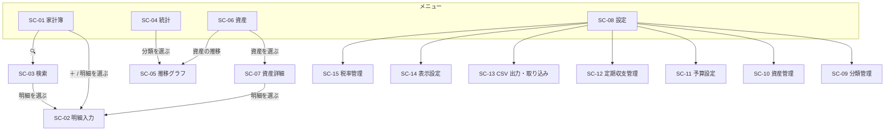

# 画面設計書：家計簿アプリ（BudgetManager）

| 項目 | 内容 |
|---|---|
| 文書番号 | 04 |
| 版数 | 0.1（作成中） |
| 作成日 | 2026-09-30 |
| 作成者 | major182 |
| 前提となる文書 | [01 要件定義書](01_requirements.md)、[02 技術選定書](02_tech-stack.md)、[03 DB 設計書](03_db-design.md) |

---

## 目次

1. [共通方針](#1-共通方針)
2. [画面遷移図](#2-画面遷移図)
3. [画面一覧と URL](#3-画面一覧と-url)
4. [画面ごとの詳細](#4-画面ごとの詳細)
5. CSV の形式（作成中）
6. メッセージ一覧（作成中）
7. 機能との対応（作成中）
8. [改訂履歴](#8-改訂履歴)

### この文書の位置づけ

- **画面の仕様の正**。プロトタイプ（画面の試作）と実装は、この文書に合わせる
- プロトタイプは見た目を確かめるためのもので、仕様の正ではない。プロトタイプと食い違ったら、この文書が正（CLAUDE.md 2章）

---

## 1. 共通方針

### 1.1 画面の骨組み

画面幅 **768px 未満をスマホ**、**768px 以上を PC** のレイアウトにする（NF-EN-02）。

**スマホ**

```
┌──────────────────────────┐
│ ‹  2026年10月  ›      🔍 │ ← ヘッダー（画面ごとに内容が変わる）
├──────────────────────────┤
│                          │
│                          │
│         本体             │ ← 縦にスクロールする
│                          │
│                      (＋)│ ← 家計簿の画面だけ、右下に入力ボタン
├──────────────────────────┤
│ 家計簿  統計  資産  設定 │ ← メニュー（画面の下に固定）
└──────────────────────────┘
```

**PC**

```
┌──────────┬──────────────────────────────────────┐
│ 家計簿   │ ‹  2026年10月  ›                  🔍 │ ← ヘッダー
│ 統計     ├──────────────────────────────────────┤
│ 資産     │                                      │
│ 設定     │         本体（幅の上限 960px）       │
│          │                                      │
│          │                                  (＋)│
│ ↑メニュー│                                      │
│（左に固定）                                     │
└──────────┴──────────────────────────────────────┘
```

- メニューは **家計簿・統計・資産・設定** の4つ（S-3）。表示中の画面のメニューを強調する
- PC の本体は幅の上限を 960px とし、広い画面では中央に寄せる（1920px の画面でも横に広がりすぎないようにする）

### 1.2 色の使い方

| 用途 | 色 | 例 |
|---|---|---|
| 収入 | **青** | 収入の金額、収入の合計 |
| 支出 | **赤** | 支出の金額、支出の合計 |
| 振替 | **灰色** | 振替の金額 |
| 予算の超過 | 赤の背景 | 消化率が 100% を超えた予算（F-BG-03） |
| 土曜・日曜祝日 | 青・赤の文字 | カレンダーの日付 |

- 色はテーマ（ライト・ダーク）ごとに、CSS 変数で切り替える（F-CF-04、技術選定書 5.5）
- 色だけで区別しない。金額の前に「＋」「−」を付けるなど、色が分からなくても読み取れるようにする

### 1.3 金額・日付の表示

| 対象 | 表示 | 例 |
|---|---|---|
| 金額 | 設定の通貨記号と桁区切りに従う（F-CF-01） | ¥1,080 ／ 1,080円 ／ 1080 |
| マイナスの金額 | 先頭に「−」 | −¥500 |
| 年月（見出し） | 「YYYY年M月」 | 2026年10月 |
| 月の期間 | 開始日が1日以外のときだけ、見出しの下に期間を出す | 9/25〜10/24 |
| 日付（一覧） | 「M/D（曜日）」 | 10/15（木） |
| 日付（入力） | ブラウザ標準の日付入力 | 2026-10-15 |

### 1.4 画面の一部だけを差し替える単位（htmx）

htmx（技術選定書 5.3）で、次の単位で画面の一部だけを差し替える。**差し替えたときは URL も更新する**（ブラウザの「戻る」で前の表示に戻れ、URL を開き直しても同じ表示になるように）。

| 操作 | 差し替える範囲 | URL の更新 |
|---|---|---|
| 年月の切り替え（‹ ›） | ヘッダーの年月と本体 | する |
| タブの切り替え（日別／カレンダー／月別など） | 本体 | する |
| 入力欄の誤り | フォームだけ（入力した値は残す） | しない |
| 登録・保存・削除の完了 | 元の一覧を最新にする | しない |
| 内訳の行の追加・削除（SC-02） | 内訳の欄だけ | しない |

- 通信中は、押したボタンを押せない状態にし、処理中であることを表示する（二重に登録されるのを防ぐ）
- htmx の通信には CSRF トークンを付ける（技術選定書 7.2 S-01）

### 1.5 入力とエラー

- **入力の誤りは、その入力欄のすぐ下に赤字で表示**する。どの項目がなぜ誤りかを日本語で示す（NF-UX-03）
- 複数の項目にまたがる誤り（例：振替の出金元と入金先が同じ）は、フォームの一番上に表示する
- 入力のチェックは**必ずサーバー（Django のフォーム）で行う**。ブラウザ側のチェックは入力を助けるためのもので、それだけには頼らない（CLAUDE.md 3.1）
- 必須の項目には、項目名の横に「必須」と表示する
- スマホで数字を入れる欄は、数字のキーボードが出るようにする

### 1.6 確認と完了の知らせ

- **削除は、必ず確認ダイアログを出してから行う**（F-TX-03）。ダイアログには、何を削除するのかを表示する
- 登録・保存・削除が終わったら、画面の上部に短い知らせ（「登録しました」など）を数秒表示する
- 文言は6章のメッセージ一覧に合わせる

### 1.7 明細入力の出し方（S-1）

| 端末 | 出し方 | 閉じたあと |
|---|---|---|
| スマホ | **画面全体**に入力画面を表示する（メニューは隠す） | 元の画面に戻り、一覧を最新にする |
| PC | **画面の上に重ねた小窓（モーダル）**で表示する。後ろの一覧は見えたまま | 小窓を閉じ、後ろの一覧を最新にする |

どちらも同じ URL（SC-02）で開ける。URL を直接開いた場合は、画面全体に表示する。

### 1.8 使いやすさ

- ボタンなど押す場所は、スマホで 44px 四方以上にする（NF-UX-02）
- データがないときは、空の一覧ではなく「この月の明細はありません」などの案内を出す
- 入力画面を開いてから支出を登録するまで、10 秒程度で終わる操作の流れにする（NF-UX-01。SC-02 で具体化する）

---

## 2. 画面遷移図



- メニューの4画面（家計簿・統計・資産・設定）は、どの画面からでもメニューで移れる（図では省略）
- 明細入力（SC-02）を閉じると、開いた元の画面に戻る

---

## 3. 画面一覧と URL

URL は、そのまま Django の URL の設計になる。`<年月>` は `2026-10` の形、`<年>` は `2026`、`<id>` は各データの番号。

| ID | 画面 | URL | 表示の切り替え | 主な機能 |
|---|---|---|---|---|
| ― | トップ | `/` | ― | 家計簿（今月の日別）へ移る |
| SC-01 | 家計簿 | `/ledger/daily/<年月>/`<br>`/ledger/calendar/<年月>/`<br>`/ledger/monthly/<年>/` | タブ：日別／カレンダー／月別 | F-LS-01〜05 |
| SC-02 | 明細入力 | `/transactions/new/`<br>`/transactions/<id>/edit/`<br>`/transactions/<id>/copy/` | 新規／編集／コピー | F-TX-01〜08 |
| SC-03 | 検索 | `/transactions/search/` | ― | F-LS-06 |
| SC-04 | 統計 | `/stats/<年月>/`<br>`/stats/year/<年>/` | 支出／収入、月／年 | F-ST-01〜03、F-ST-06、F-BG-03 |
| SC-05 | 推移グラフ | `/stats/trends/categories/<id>/`<br>`/stats/trends/assets/` | 分類の推移／資産の推移 | F-ST-04、F-ST-05 |
| SC-06 | 資産 | `/assets/` | ― | F-AS-03 |
| SC-07 | 資産詳細 | `/assets/<id>/<年月>/` | ― | F-AS-04、F-AS-05（表示） |
| SC-08 | 設定 | `/settings/` | ― | 各設定画面への入口 |
| SC-09 | 分類管理 | `/settings/categories/` | 支出／収入 | F-CT-01、F-CT-02 |
| SC-10 | 資産管理 | `/settings/assets/` | ― | F-AS-01、F-AS-02、F-AS-05（設定） |
| SC-11 | 予算設定 | `/settings/budgets/` | ― | F-BG-01、F-BG-02 |
| SC-12 | 定期収支管理 | `/settings/recurring/` | ― | F-RC-01、F-RC-02 |
| SC-13 | CSV 出力・取り込み | `/settings/csv/` | ― | F-IO-01、F-IO-02 |
| SC-14 | 表示設定 | `/settings/display/` | ― | F-CF-01〜05 |
| SC-15 | 税率管理 | `/settings/tax-rates/` | ― | F-TR-01 |

- 登録・保存・削除は、画面の URL とは別に、データを変える操作用の URL（POST）を用意する。細かな URL は画面ごとの詳細（4章）で定める
- 期間を持つ画面（SC-01・04・07）は、URL に年月を含める。今月を表示するときも URL には年月が入る

---

## 4. 画面ごとの詳細

### 4.0 表の見方

- **レイアウト**：スマホの図を基本にし、PC で違う点だけを書く
- **項目**：画面に出す値と入力欄。「種類」は、表示（読むだけ）／入力（テキスト・数値・日付・選択など）／ボタン
- **操作**：利用者の操作と、そのときの画面の動き
- メッセージの文言は6章にまとめる（本章では要約だけを書く）

---

### 4.1 SC-01 家計簿

期間内の明細を、日別・カレンダー・月別で表示する。アプリの中心の画面。

**レイアウト（日別）**

```
┌──────────────────────────┐
│ ‹  2026年10月  ›      🔍 │
│      9/25〜10/24         │ ← 月の開始日が1日以外のときだけ
├──────────────────────────┤
│ 収入      支出     合計  │
│ ¥250,000  ¥82,400 ¥167,600│ ← 期間の合計（F-LS-04）
├──────────────────────────┤
│ [日別] カレンダー  月別  │ ← タブ
├──────────────────────────┤
│ 15 木          ¥0 ¥1,960 │ ← 日の見出し（その日の収入・支出）
│ 食費 他2件        −¥1,960│
│  スーパー  現金          │
│ 14 水      ¥250,000   ¥0 │
│ 給与        ＋¥250,000   │
│  10月分  銀行            │
│ 振替          ¥30,000    │
│  銀行 → 現金             │
│                      (＋)│
├──────────────────────────┤
│ 家計簿  統計  資産  設定 │
└──────────────────────────┘
```

**レイアウト（カレンダー）**

```
├──────────────────────────┤
│ 日  月  火  水  木  金  土│ ← 週の開始曜日は設定に従う（BR-22）
│ 25  26  27  28  29  30   1│ ← 期間の外の日は薄く表示
│    +3k  -1k               │ ← 収入（青）・支出（赤）
│ …                        │
├──────────────────────────┤
│ 10/15（木）の明細        │ ← 選んだ日の明細（日別と同じ形）
│ 食費 他2件        −¥1,960│
└──────────────────────────┘
```

**レイアウト（月別）**

```
│ ‹  2026年  ›          🔍 │ ← 年の切り替え
│ 収入      支出     合計  │ ← 年の合計
│ 日別  カレンダー  [月別] │
├──────────────────────────┤
│ 10月  9/25〜10/24        │
│  ＋¥250,000 −¥82,400  ¥167,600│
│ 9月   8/25〜9/24         │
│  …                       │
```

- PC では、日別の明細を1行に収める（分類・内容・資産・金額を横に並べる）

**項目**

| 項目 | 種類 | 内容 | 出典 |
|---|---|---|---|
| 年月（年） | 表示 | 表示中の期間。「‹」「›」で前後へ移る | F-LS-05 |
| 期間 | 表示 | 月の開始日が1日以外のときだけ表示 | BR-20 |
| 収入・支出・合計 | 表示 | 期間の合計。振替は含めない | F-LS-04、BR-14 |
| タブ | 選択 | 日別／カレンダー／月別 | F-LS-01〜03 |
| 日の見出し | 表示 | 日付と曜日、その日の収入・支出の合計 | F-LS-01 |
| 明細の行：分類 | 表示 | 内訳の分類（小分類があれば「大分類／小分類」）。内訳が複数なら「最初の内訳の分類 他N件」。振替は「振替」 | F-LS-01 |
| 明細の行：内容・資産 | 表示 | 内容と資産。振替は「出金元 → 入金先」 | F-LS-01 |
| 明細の行：金額 | 表示 | 収入は青の「＋」、支出は赤の「−」、振替は灰色。マイナス支出は青の「＋」 | 1.2 |
| 明細の行：定期の印 | 表示 | 定期収支で自動登録された明細には「定期」の印を付ける | BR-65 |
| カレンダーの日 | 表示 | 日付（土曜は青、日曜・祝日は赤）、その日の収入・支出の合計（1万円以上は「3.2万」のように縮める） | F-LS-02 |
| 月別の行 | 表示 | 月・期間・収入・支出・差額 | F-LS-03 |
| ＋ボタン | ボタン | 明細入力（SC-02）を開く | F-TX-01 |
| 🔍ボタン | ボタン | 検索（SC-03）を開く | F-LS-06 |

**操作**

| 操作 | 動き |
|---|---|
| 「‹」「›」 | 前後の月（月別では前後の年）へ移る。本体を差し替え、URL を更新する |
| 年月を押す | 年月を選ぶ小窓を出し、選んだ月へ移る。「今月」ボタンで今月に戻る（F-LS-05） |
| タブを押す | 表示を切り替える。月別へ切り替えると、表示中の月の年を表示する |
| 明細の行を押す | 明細入力（SC-02）を編集の状態で開く |
| カレンダーの日を押す | その日の明細を、カレンダーの下に表示する |
| 月別の行を押す | その月の日別へ移る |
| ＋ボタン | 明細入力（SC-02）を新規の状態で開く。日付の初期値は今日（カレンダーで日を選んでいれば、その日） |

**表示の順番**：日別は新しい日付が上。同じ日の中では、登録が新しいものが上。

---

### 4.2 SC-02 明細入力

収入・支出・振替を登録・編集・コピーする。**最も入力の多い画面**のため、スマホでの操作の速さを優先する（NF-UX-01）。

**レイアウト（支出）**

```
┌──────────────────────────┐
│ ×  明細の登録        登録│ ← 編集では「明細の編集」「保存」
├──────────────────────────┤
│ [支出]  収入   振替      │ ← 種類（初期値は支出）
├──────────────────────────┤
│ 日付   2026-10-15（木） │
│ 資産   現金          ▼  │
│ 内容   スーパー          │ ← 入力すると過去の内容を候補に出す
├──────────────────────────┤
│ 金額の入力  [税込] 税抜  │
│ ┌ 内訳1 ─────────────┐ │
│ │ 分類  食費        ▼ │ │
│ │ 税率  軽減税率 8% ▼ │ │
│ │ 金額  1,080    [🖩] │ │ ← 🖩 は電卓
│ └──────────────────┘ │
│ ┌ 内訳2 ─────────── × ┐ │ ← 2行目から削除できる
│ │ 分類  備品・衣類  ▼ │ │
│ │ 税率  標準税率 10%▼ │ │
│ │ 金額  880      [🖩] │ │
│ └──────────────────┘ │
│ ＋ 内訳を追加            │
├──────────────────────────┤
│        税抜    税  税込  │ ← 入力に合わせて計算して表示
│ 8%    1,000    80  1,080 │
│ 10%     800    80    880 │
│ 合計  1,800   160  1,960 │
├──────────────────────────┤
│ メモ                     │
├──────────────────────────┤
│ [削除]          [コピー] │ ← 編集のときだけ
└──────────────────────────┘
```

**レイアウト（振替）**：内訳・税率・税込／税抜の欄がなく、「出金元」「入金先」「金額」を入力する。

**項目（収入・支出）**

| 項目 | 種類 | 必須 | 初期値 | 入力規則 | 出典 |
|---|---|---|---|---|---|
| 種類 | 選択 | ○ | 支出（編集では登録済みの種類） | 支出／収入／振替 | BR-10 |
| 日付 | 日付 | ○ | 今日（コピーでも今日） | ― | F-TX-01、BR-15 |
| 資産 | 選択 | ○ | 前回その種類で登録した明細の資産。なければ並び順の最初 | 非表示の資産は選択肢に出さない（編集中の明細が使っているものは出す） | BR-11、BR-44 |
| 内容 | テキスト | | 空 | 100文字まで。入力中に過去の内容を候補に出す | F-TX-05 |
| 金額の入力 | 選択 | ○ | 設定の既定値（税込） | 税込／税抜 | BR-72、BR-79 |
| 内訳：分類 | 選択 | ○ | 空 | 明細の種類に合った分類（収入なら収入用）。大分類・小分類のどちらも選べる。非表示の分類は出さない | BR-30、BR-31、BR-80 |
| 内訳：税率 | 選択 | ○ | 分類を選ぶと、その分類の既定の税率。分類に既定がなければ設定の既定値 | 非表示の税率は出さない | BR-70、BR-78、BR-79 |
| 内訳：金額 | 数値 | ○ | 空 | 整数。支出だけマイナスを入力できる。1件の明細でプラスとマイナスを混ぜない | BR-03、BR-12 |
| 税額の表 | 表示 | | | 税率ごとと合計の、税抜・税・税込。入力のたびにサーバーで計算して表示する（5.6 の計算と同じ結果にするため） | F-TX-08 |
| メモ | テキスト | | 空 | 500文字まで | F-TX-01 |

- 内訳は最大 20 行まで追加できる
- 明細の金額（内訳の税込額の合計）が BR-03 の範囲（−99,999,999〜99,999,999、0 以外）に収まること

**項目（振替）**

| 項目 | 種類 | 必須 | 初期値 | 入力規則 | 出典 |
|---|---|---|---|---|---|
| 日付 | 日付 | ○ | 今日 | ― | F-TX-02 |
| 出金元 | 選択 | ○ | 前回の振替の出金元 | ― | BR-13 |
| 入金先 | 選択 | ○ | 前回の振替の入金先 | 出金元と違う資産 | BR-13 |
| 金額 | 数値 | ○ | 空 | 1〜99,999,999 の整数 | BR-03 |
| 内容・メモ | テキスト | | 空 | 収入・支出と同じ | F-TX-02 |

**操作**

| 操作 | 動き |
|---|---|
| 種類を切り替える | 入力欄を切り替える。収入と支出の間では、日付・資産・内容・メモ・金額を引き継ぎ、分類は空に戻す（収入用と支出用で分類が違うため）。振替との間では、日付・内容・メモ・金額を引き継ぐ |
| 内容を入力する | 入力した文字で始まる過去の内容を、新しい順に最大 10 件、候補として出す |
| 候補を選ぶ | その内容で最後に登録した明細の、資産・分類・税率・金額（1行目の内訳）を入力欄に入れる。入力済みの金額は上書きしない（F-TX-05） |
| 分類を選ぶ | その内訳の税率を、分類の既定の税率に変える |
| 🖩（電卓）を押す | 電卓を開く（下記） |
| 金額・税率・税込／税抜を変える | 税額の表を計算し直す |
| 「＋ 内訳を追加」 | 内訳を1行追加する。分類・税率は空、金額は空 |
| 内訳の「×」 | その内訳を削除する（1行目は削除できない） |
| 「登録」「保存」 | サーバーで入力をチェックする。誤りがあれば欄の下に表示し、入力した値は残す。正しければ登録し、画面を閉じて元の一覧を最新にする |
| 「削除」（編集のみ） | 確認ダイアログを出し、「削除する」を押したら削除する（F-TX-03） |
| 「コピー」（編集のみ） | この明細の内容で、新規の入力画面を開く。日付は今日にする（BR-15） |
| 「×」（閉じる） | 入力中の内容があれば「入力中の内容を破棄しますか」と確認してから閉じる |

**電卓（F-TX-06）**

```
┌──────────────────────────┐
│               1,080 + 880│ ← 式
│                    = 1,960│ ← 結果
│  C    ←    ÷    ×        │
│  7    8    9    −        │
│  4    5    6    ＋        │
│  1    2    3    =        │
│  00   0      [ 決定 ]    │
└──────────────────────────┘
```

- 四則演算ができる。「決定」で結果を金額の欄に入れて閉じる
- 結果に小数が出た場合は、**小数点以下を切り捨てて**入れる（金額は円の整数のため。BR-02）
- 電卓は画面の中だけで動く JavaScript で作る（サーバーへの通信は不要）

---

### 4.3 SC-03 検索

条件を指定して明細を探す（F-LS-06）。

**レイアウト**

```
┌──────────────────────────┐
│ ‹  明細の検索            │
├──────────────────────────┤
│ キーワード [          ]  │
│ 種類  [すべて ▼]         │
│ 分類  [すべて ▼]         │
│ 資産  [すべて ▼]         │
│ 金額  [    ]〜[    ]     │
│ 期間  [2025-10-16]〜[2026-10-15]│
│           [ 検索 ]       │
├──────────────────────────┤
│ 25件  収入 ¥0  支出 ¥18,400│
│ 10/15（木） 食費 −¥1,960 │
│  スーパー  現金          │
│ …                        │
│      [ さらに表示 ]      │
└──────────────────────────┘
```

**項目**

| 項目 | 種類 | 初期値 | 入力規則 |
|---|---|---|---|
| キーワード | テキスト | 空 | 内容・メモを**部分一致**で探す |
| 種類 | 選択 | すべて | すべて／収入／支出／振替 |
| 分類 | 選択 | すべて | 大分類を選ぶと、その小分類も含めて探す |
| 資産 | 選択 | すべて | 振替では、出金元・入金先のどちらかに一致すれば対象 |
| 金額 | 数値×2 | 空 | 下限〜上限（どちらか片方だけでもよい）。明細の金額で比べる |
| 期間 | 日付×2 | 過去1年（今日の1年前の翌日〜今日） | 開始 ≦ 終了 |
| 結果の件数・合計 | 表示 | | 見つかった件数と、収入・支出の合計 |
| 結果の一覧 | 表示 | | 日別の一覧と同じ形。日付の新しい順に **50 件ずつ**表示する |

**操作**

| 操作 | 動き |
|---|---|
| 「検索」 | 条件で探し、結果の欄だけを差し替える。条件は URL に残す（戻ったときに同じ結果を出すため） |
| 「さらに表示」 | 次の 50 件を下に追加する |
| 結果の行を押す | 明細入力（SC-02）を編集の状態で開く。閉じると、同じ条件で結果を最新にする |

---

### 4.4 SC-04 統計

期間内の収入・支出を分類別に集計し、予算の消化状況と消費税額を表示する。

**レイアウト**

```
┌──────────────────────────┐
│ ‹  2026年10月  ›  [月]年 │ ← 月／年の切り替え（F-ST-03）
├──────────────────────────┤
│ [支出 ¥82,400]  収入 ¥250,000 │ ← タブ
├──────────────────────────┤
│        ╭────╮            │
│      ╱  円    ╲          │ ← 円グラフ（F-ST-01）
│      ╲ グラフ ╱          │
│        ╰────╯            │
├──────────────────────────┤
│ ■ 食費     42%  ¥34,600 ›│ ← 押すと小分類を開く
│   └ 外食         ¥12,000 │
│   └ 小分類なし   ¥22,600 │
│ ■ 光熱費   15%  ¥12,300 ›│
│ …                        │
├──────────────────────────┤
│ 予算                     │ ← 月・支出のときだけ（F-BG-03）
│ 全体   ¥82,400 / ¥150,000│
│ ▓▓▓▓▓▓░░░░░ 55%  残り ¥67,600│
│ 食費   ¥34,600 / ¥30,000 │
│ ▓▓▓▓▓▓▓▓▓▓▓ 115% 超過 ¥4,600│ ← 超過は赤
├──────────────────────────┤
│ 消費税                   │ ← F-ST-06
│ 税率   税抜      消費税  │
│ 0%      2,000        0   │
│ 8%     32,038    2,562   │
│ 10%    41,637    4,163   │
│ 合計   75,675    6,725   │
└──────────────────────────┘
```

- PC では、円グラフと分類の一覧を横に並べる

**項目**

| 項目 | 種類 | 内容 | 出典 |
|---|---|---|---|
| 年月／年 | 表示 | 表示中の期間。「‹」「›」で前後へ | F-ST-03 |
| 月／年 | 選択 | 集計の単位 | F-ST-03 |
| 支出／収入のタブ | 選択 | それぞれの合計も表示する | F-ST-01 |
| 円グラフ | 表示 | 大分類ごとの割合。割合の大きい順。**上位 8 分類**まで色を分け、残りは「その他」にまとめる | F-ST-01 |
| 分類の一覧 | 表示 | 大分類・割合・金額。金額の大きい順。すべての大分類を出す | F-ST-01 |
| 小分類の一覧 | 表示 | 大分類を押すと、その下に小分類ごとの金額と「小分類なし」を出す | F-ST-02 |
| 予算 | 表示 | 予算ごとの消化額・予算額・消化率のバー・残額。超過は赤。**月・支出のときだけ**表示する（予算は月単位のため） | F-BG-03、5.5 |
| 消費税 | 表示 | 税率ごとの税抜額・消費税額の合計と、全体の合計 | F-ST-06 |

**操作**

| 操作 | 動き |
|---|---|
| 大分類の行を押す | 小分類の一覧を開く／閉じる |
| 小分類の一覧の「推移を見る」 | その大分類の推移グラフ（SC-05）へ移る |
| 予算の行を押す | 予算設定（SC-11）へ移る |
| 予算がない場合 | 予算の欄に「予算が設定されていません」と「予算を設定する」（SC-11 へ）を出す |

---

### 4.5 SC-05 推移グラフ

分類ごとの金額の推移（F-ST-04）と、資産の推移（F-ST-05）を表示する。

**レイアウト（分類の推移）**

```
┌──────────────────────────┐
│ ‹  食費の推移            │
│ 2025年11月〜2026年10月 ‹ ›│ ← 12か月分。‹ › で1か月ずつずらす
├──────────────────────────┤
│  ▇                       │
│  ▇ ▇    ▇       ▇        │ ← 棒グラフ
│  ▇ ▇ ▇  ▇ ▇  ▇  ▇ ▇ ▇ ▇  │
│  11 12 1 2 3 4 5 6 7 8 9 10│
├──────────────────────────┤
│ 平均 ¥31,200  最大 ¥42,000│
│ 10月  ¥34,600            │
│ 9月   ¥28,900            │
│ …                        │
└──────────────────────────┘
```

**レイアウト（資産の推移）**

```
┌──────────────────────────┐
│ ‹  資産の推移            │
│ [全体 ▼]                 │ ← 全体／個別の資産
│ 2025年11月〜2026年10月 ‹ ›│
├──────────────────────────┤
│  折れ線グラフ            │ ← 全体：資産合計・負債合計・純資産の3本
│                          │   個別：その資産の残高の1本
├──────────────────────────┤
│ 10月末  資産 ¥1,050,000  │
│         負債 ¥30,000     │
│         純資産 ¥1,020,000│
│ …                        │
└──────────────────────────┘
```

**項目**

| 項目 | 種類 | 内容 | 出典 |
|---|---|---|---|
| 対象の期間 | 表示 | 表示中の月を最後とする 12 か月。「‹」「›」で1か月ずつずらす | F-ST-04、F-ST-05 |
| 棒グラフ・表（分類） | 表示 | 各月の、その分類（小分類を含む）の金額。平均・最大も表示 | F-ST-04、5.4 |
| 資産の選択 | 選択 | 全体／各資産（非表示の資産も選べる） | F-ST-05 |
| 折れ線グラフ・表（資産） | 表示 | 各月の終了日（5.2）の時点の残高 | F-ST-05、5.3 |

---

### 4.6 SC-06 資産

資産グループごとに、資産の現在の残高を表示する（F-AS-03）。

**レイアウト**

```
┌──────────────────────────┐
│ 資産                  📈 │ ← 📈 で資産の推移（SC-05）
├──────────────────────────┤
│ 資産        負債   純資産│
│ ¥1,050,000 ¥30,000 ¥1,020,000│
├──────────────────────────┤
│ 現金               ¥8,200│ ← 資産グループと小計
│  現金              ¥8,200│
│ 銀行           ¥1,041,800│
│  〇〇銀行      ¥1,041,800│
│ クレジットカード −¥30,000│
│  △△カード        −¥30,000│
│   次回 10/27 ¥28,500（目安）│ ← カードは次回の引き落とし
├──────────────────────────┤
│ □ 非表示の資産も表示     │
└──────────────────────────┘
```

**項目**

| 項目 | 種類 | 内容 | 出典 |
|---|---|---|---|
| 資産・負債・純資産 | 表示 | 5.3 の式で計算した今日時点の額 | BR-42 |
| 資産グループ | 表示 | 名前と、属する資産の残高の小計。並び順に表示 | F-AS-03 |
| 資産の行 | 表示 | 名前と現在の残高。マイナスは赤 | F-AS-03 |
| カードの次回の引き落とし | 表示 | 引き落とし日と請求額。締め日前なら「（目安）」を付ける | F-AS-05、5.7 |
| 非表示の資産も表示 | 選択 | 初期値は表示しない。**非表示の資産も、資産・負債・純資産の合計には含める**（お金としては存在するため） | BR-44 |

**操作**

| 操作 | 動き |
|---|---|
| 資産の行を押す | 資産詳細（SC-07）へ移る（今月） |
| 📈 | 資産の推移（SC-05）へ移る |

---

### 4.7 SC-07 資産詳細

1つの資産の、期間内の明細と残高の動きを表示する（F-AS-04）。カードは請求の情報も表示する（F-AS-05）。

**レイアウト**

```
┌──────────────────────────┐
│ ‹  〇〇銀行              │
│ ‹  2026年10月  ›         │
├──────────────────────────┤
│ 月初    入金    出金  月末│
│ 1,000,000 +250,000 −208,200 1,041,800│
├──────────────────────────┤
│ 10/15（木）              │
│ 振替 → 現金   −¥30,000   │
│               残高 1,041,800│ ← その明細の後の残高
│ 10/14（水）              │
│ 給与        ＋¥250,000   │
│               残高 1,071,800│
│ …                        │
└──────────────────────────┘
```

**カードの場合（上部に追加）**

```
├──────────────────────────┤
│ 月末締め・翌月27日払い（〇〇銀行から）│
│ 10/27 引き落とし  ¥28,500 │ ← 9/30 締めの分
│ 11/27 引き落とし  ¥12,300（目安）│ ← 10/31 締めの分（締め日前）
├──────────────────────────┤
```

**項目**

| 項目 | 種類 | 内容 | 出典 |
|---|---|---|---|
| 資産名・年月 | 表示 | 「‹」「›」で前後の月へ | F-AS-04 |
| 月初・入金・出金・月末 | 表示 | 期間の開始日の前日の残高、期間内の入金と出金の合計、期間の終了日の残高 | 5.3 |
| 明細の一覧 | 表示 | この資産に関わる明細（振替の出金元・入金先を含む）。日付の新しい順。各明細の後の残高を表示する | F-AS-04 |
| カードの設定 | 表示 | 締め日・引き落とし日・引き落とし口座 | BR-43 |
| 引き落とし予定 | 表示 | 引き落とし日が今日以降の請求を、早い順に最大 2 件。締め日前の分は「（目安）」 | F-AS-05、5.7 |

**操作**

| 操作 | 動き |
|---|---|
| 明細の行を押す | 明細入力（SC-02）を編集の状態で開く |

---

## 8. 改訂履歴

| 版数 | 日付 | 内容 |
|---|---|---|
| 0.1 | 2026-09-30 | 作成開始（共通方針・画面遷移図・画面一覧と URL・メインの画面の詳細） |
