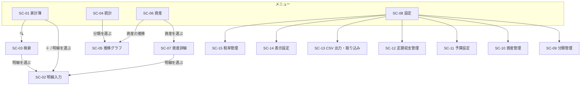

# 画面設計書：家計簿アプリ（BudgetManager）

| 項目 | 内容 |
|---|---|
| 文書番号 | 04 |
| 版数 | 0.1（作成中） |
| 作成日 | 2026-09-30 |
| 作成者 | major182 |
| 前提となる文書 | [01 要件定義書](01_requirements.md)、[02 技術選定書](02_tech-stack.md)、[03 DB 設計書](03_db-design.md) |

---

## 目次

1. [共通方針](#1-共通方針)
2. [画面遷移図](#2-画面遷移図)
3. [画面一覧と URL](#3-画面一覧と-url)
4. 画面ごとの詳細（作成中）
5. CSV の形式（作成中）
6. メッセージ一覧（作成中）
7. 機能との対応（作成中）
8. [改訂履歴](#8-改訂履歴)

### この文書の位置づけ

- **画面の仕様の正**。プロトタイプ（画面の試作）と実装は、この文書に合わせる
- プロトタイプは見た目を確かめるためのもので、仕様の正ではない。プロトタイプと食い違ったら、この文書が正（CLAUDE.md 2章）

---

## 1. 共通方針

### 1.1 画面の骨組み

画面幅 **768px 未満をスマホ**、**768px 以上を PC** のレイアウトにする（NF-EN-02）。

**スマホ**

```
┌──────────────────────────┐
│ ‹  2026年10月  ›      🔍 │ ← ヘッダー（画面ごとに内容が変わる）
├──────────────────────────┤
│                          │
│                          │
│         本体             │ ← 縦にスクロールする
│                          │
│                      (＋)│ ← 家計簿の画面だけ、右下に入力ボタン
├──────────────────────────┤
│ 家計簿  統計  資産  設定 │ ← メニュー（画面の下に固定）
└──────────────────────────┘
```

**PC**

```
┌──────────┬──────────────────────────────────────┐
│ 家計簿   │ ‹  2026年10月  ›                  🔍 │ ← ヘッダー
│ 統計     ├──────────────────────────────────────┤
│ 資産     │                                      │
│ 設定     │         本体（幅の上限 960px）       │
│          │                                      │
│          │                                  (＋)│
│ ↑メニュー│                                      │
│（左に固定）                                     │
└──────────┴──────────────────────────────────────┘
```

- メニューは **家計簿・統計・資産・設定** の4つ（S-3）。表示中の画面のメニューを強調する
- PC の本体は幅の上限を 960px とし、広い画面では中央に寄せる（1920px の画面でも横に広がりすぎないようにする）

### 1.2 色の使い方

| 用途 | 色 | 例 |
|---|---|---|
| 収入 | **青** | 収入の金額、収入の合計 |
| 支出 | **赤** | 支出の金額、支出の合計 |
| 振替 | **灰色** | 振替の金額 |
| 予算の超過 | 赤の背景 | 消化率が 100% を超えた予算（F-BG-03） |
| 土曜・日曜祝日 | 青・赤の文字 | カレンダーの日付 |

- 色はテーマ（ライト・ダーク）ごとに、CSS 変数で切り替える（F-CF-04、技術選定書 5.5）
- 色だけで区別しない。金額の前に「＋」「−」を付けるなど、色が分からなくても読み取れるようにする

### 1.3 金額・日付の表示

| 対象 | 表示 | 例 |
|---|---|---|
| 金額 | 設定の通貨記号と桁区切りに従う（F-CF-01） | ¥1,080 ／ 1,080円 ／ 1080 |
| マイナスの金額 | 先頭に「−」 | −¥500 |
| 年月（見出し） | 「YYYY年M月」 | 2026年10月 |
| 月の期間 | 開始日が1日以外のときだけ、見出しの下に期間を出す | 9/25〜10/24 |
| 日付（一覧） | 「M/D（曜日）」 | 10/15（木） |
| 日付（入力） | ブラウザ標準の日付入力 | 2026-10-15 |

### 1.4 画面の一部だけを差し替える単位（htmx）

htmx（技術選定書 5.3）で、次の単位で画面の一部だけを差し替える。**差し替えたときは URL も更新する**（ブラウザの「戻る」で前の表示に戻れ、URL を開き直しても同じ表示になるように）。

| 操作 | 差し替える範囲 | URL の更新 |
|---|---|---|
| 年月の切り替え（‹ ›） | ヘッダーの年月と本体 | する |
| タブの切り替え（日別／カレンダー／月別など） | 本体 | する |
| 入力欄の誤り | フォームだけ（入力した値は残す） | しない |
| 登録・保存・削除の完了 | 元の一覧を最新にする | しない |
| 内訳の行の追加・削除（SC-02） | 内訳の欄だけ | しない |

- 通信中は、押したボタンを押せない状態にし、処理中であることを表示する（二重に登録されるのを防ぐ）
- htmx の通信には CSRF トークンを付ける（技術選定書 7.2 S-01）

### 1.5 入力とエラー

- **入力の誤りは、その入力欄のすぐ下に赤字で表示**する。どの項目がなぜ誤りかを日本語で示す（NF-UX-03）
- 複数の項目にまたがる誤り（例：振替の出金元と入金先が同じ）は、フォームの一番上に表示する
- 入力のチェックは**必ずサーバー（Django のフォーム）で行う**。ブラウザ側のチェックは入力を助けるためのもので、それだけには頼らない（CLAUDE.md 3.1）
- 必須の項目には、項目名の横に「必須」と表示する
- スマホで数字を入れる欄は、数字のキーボードが出るようにする

### 1.6 確認と完了の知らせ

- **削除は、必ず確認ダイアログを出してから行う**（F-TX-03）。ダイアログには、何を削除するのかを表示する
- 登録・保存・削除が終わったら、画面の上部に短い知らせ（「登録しました」など）を数秒表示する
- 文言は6章のメッセージ一覧に合わせる

### 1.7 明細入力の出し方（S-1）

| 端末 | 出し方 | 閉じたあと |
|---|---|---|
| スマホ | **画面全体**に入力画面を表示する（メニューは隠す） | 元の画面に戻り、一覧を最新にする |
| PC | **画面の上に重ねた小窓（モーダル）**で表示する。後ろの一覧は見えたまま | 小窓を閉じ、後ろの一覧を最新にする |

どちらも同じ URL（SC-02）で開ける。URL を直接開いた場合は、画面全体に表示する。

### 1.8 使いやすさ

- ボタンなど押す場所は、スマホで 44px 四方以上にする（NF-UX-02）
- データがないときは、空の一覧ではなく「この月の明細はありません」などの案内を出す
- 入力画面を開いてから支出を登録するまで、10 秒程度で終わる操作の流れにする（NF-UX-01。SC-02 で具体化する）

---

## 2. 画面遷移図



- メニューの4画面（家計簿・統計・資産・設定）は、どの画面からでもメニューで移れる（図では省略）
- 明細入力（SC-02）を閉じると、開いた元の画面に戻る

---

## 3. 画面一覧と URL

URL は、そのまま Django の URL の設計になる。`<年月>` は `2026-10` の形、`<年>` は `2026`、`<id>` は各データの番号。

| ID | 画面 | URL | 表示の切り替え | 主な機能 |
|---|---|---|---|---|
| ― | トップ | `/` | ― | 家計簿（今月の日別）へ移る |
| SC-01 | 家計簿 | `/ledger/daily/<年月>/`<br>`/ledger/calendar/<年月>/`<br>`/ledger/monthly/<年>/` | タブ：日別／カレンダー／月別 | F-LS-01〜05 |
| SC-02 | 明細入力 | `/transactions/new/`<br>`/transactions/<id>/edit/`<br>`/transactions/<id>/copy/` | 新規／編集／コピー | F-TX-01〜08 |
| SC-03 | 検索 | `/transactions/search/` | ― | F-LS-06 |
| SC-04 | 統計 | `/stats/<年月>/`<br>`/stats/year/<年>/` | 支出／収入、月／年 | F-ST-01〜03、F-ST-06、F-BG-03 |
| SC-05 | 推移グラフ | `/stats/trends/categories/<id>/`<br>`/stats/trends/assets/` | 分類の推移／資産の推移 | F-ST-04、F-ST-05 |
| SC-06 | 資産 | `/assets/` | ― | F-AS-03 |
| SC-07 | 資産詳細 | `/assets/<id>/<年月>/` | ― | F-AS-04、F-AS-05（表示） |
| SC-08 | 設定 | `/settings/` | ― | 各設定画面への入口 |
| SC-09 | 分類管理 | `/settings/categories/` | 支出／収入 | F-CT-01、F-CT-02 |
| SC-10 | 資産管理 | `/settings/assets/` | ― | F-AS-01、F-AS-02、F-AS-05（設定） |
| SC-11 | 予算設定 | `/settings/budgets/` | ― | F-BG-01、F-BG-02 |
| SC-12 | 定期収支管理 | `/settings/recurring/` | ― | F-RC-01、F-RC-02 |
| SC-13 | CSV 出力・取り込み | `/settings/csv/` | ― | F-IO-01、F-IO-02 |
| SC-14 | 表示設定 | `/settings/display/` | ― | F-CF-01〜05 |
| SC-15 | 税率管理 | `/settings/tax-rates/` | ― | F-TR-01 |

- 登録・保存・削除は、画面の URL とは別に、データを変える操作用の URL（POST）を用意する。細かな URL は画面ごとの詳細（4章）で定める
- 期間を持つ画面（SC-01・04・07）は、URL に年月を含める。今月を表示するときも URL には年月が入る

---

## 8. 改訂履歴

| 版数 | 日付 | 内容 |
|---|---|---|
| 0.1 | 2026-09-30 | 作成開始（共通方針・画面遷移図・画面一覧と URL） |
